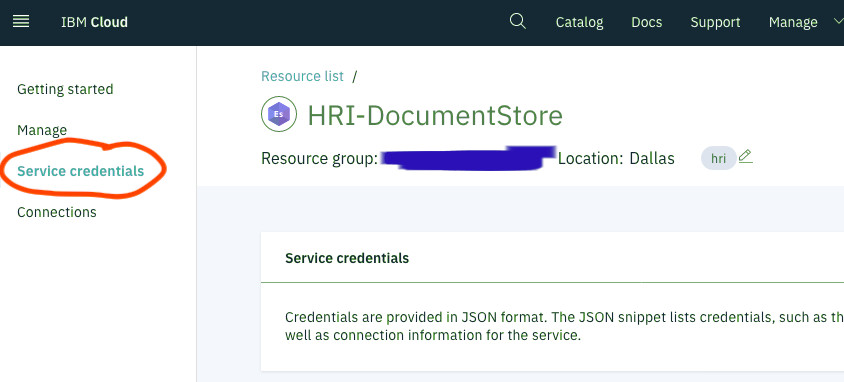

# Administration

**Tasks for administering for the Health Record Ingestion service:** 

[**Creating new tenants**](#creating-new-tenants)

- [Setting up curl with Elasticsearch](#setting-up-curl-with-elasticsearch)
- [Setting the default index template](#setting-the-default-index-template)
- [Creating a new tenant in Elasticsearch](#create-a-new-tenant-in-elasticsearch)

[**Onboarding Data Integrators**](#onboarding-new-data-integrators)
<br>[Using the management API stream endpoints](#using-the-management-api-stream-endpoints)

[**Setting up Management API keys**](#setting-up-management-api-keys)

## Creating new tenants

#### Setting up curl with Elasticsearch

Before proceeding, make sure that your existing IBM&reg; Cloud [Elasticsearch (Document Store)](glossary.md#elasticsearch) account has an existing Service Credential you can access. If you don't have a Service Credential, create one; you will use it later in this topic, for the `$USERNAME` and  `$PASSWORD` needed to run the Elasticsearch REST commands.

***

**Notes:** 

This requires the use of the [command-line cURL](https://github.com/curl/curl) tool.

For information about creating an IBM Account, see [Setting up your IBM Cloud account](https://cloud.ibm.com/docs/account?topic=account-account-getting-started). 

***

**To create a new service credential:**

1. Navigate to the Elasticsearch service instance in your [IBM Cloud account](https://cloud.ibm.com/login). In the example below, **HRI-DocumentStore** is the Elasticsearch service. 

2. In Elasticsearch, in the left menu, click **Service credentials** (Figure 1).

**Figure 1: Setting up service credentials**


3. On the Service Credentials page, click **New Credential**.

4. Type a name for the credentials.

5. Click **Add**. This generates your credentials. To view them, click **View Credentials** (Figure 2).

**Figure 2: Viewing service credentials**


6. From the expanded service credentials window, retrieve your newly-created Elasticsearch username and password. You need these for the Elasticsearch REST commands using Curl. 

> Capture the string that contains both the username and password by copying the ```-u``` "argument" from the JSON string, in the ```connection``` and ```cli``` sections). 

> In Figure 2, in the **Key Name** column, the new credential is `test-cred-1`. In the circled section after **arguments** :[", after the line with **-u**, you'll see a string starting with `ibm_cloud_40cfdf40`. The section of this string before the colon (:) is the UserName that you need. The section after the colon is the password. 

**Figure 3: Example of the UserName and Password**
     UserName: ibm_cloud_40cfdf40_e075_44aa_8bc1_04a247619e4f 
     Password: 79d9379ee59771fdf544c84538879f5ef6446e73c0707a768d031cd86e1e2020

7. For Curl to authenticate with the IBM Cloud Elasticsearch instance, download the certificate and export it. To do this, navigate to the Management screen for your Elasticsearch instance.

**Figure 4: Example of the Management screen**
   

8. Scroll down to the **Connections** panel. Click **CLI**. You will be using Curl to run commands from your local environment on the IBM Cloud Elasticsearch instance. For information about using Curl commands, see [Connecting to Elasticsearch with Curl](https://cloud.ibm.com/docs/services/databases-for-elasticsearch?topic=databases-for-elasticsearch-connecting-curl).

9. In the **Connections** panel, locate the **TLS Certificate** section. Copy the text from the **Contents** panel in that TLS Certificate section, and save it to a local file, for example: 

> ```/Users/[yourLocalUserName]/certs/hri-documentstore.crt```

10. To use the contents of this file with Curl, export it to `CURL_CA_BUNDLE`: 

> ```$ export CURL_CA_BUNDLE=/local-path/to/file/hri-documentstore.crt```

11. In the **Public CLI endpoint** box, find the base URL. In Figure 5, it starts with: 

> ```https://8165307:```
> 
> ```

**Figure 5: Finding the base URL** 


**Example of the base URL**

https://8165307e-6130-4581-942d-20fcfc4e795d.bkvfvtld0lmh0umkfi70.databases.appdomain.cloud:30600

You can now interact with the Elasticsearch REST API using Curl. To get the status of the cluster, perform a `GET` on the `_cluster/health?pretty` endpoint:

      $ curl -X GET -u ibm_cloud_40cfdf40_e075_44aa_8bc1_04a247619e4f:79d9379ee59771fdf544c84538879f5ef6446e73c0707a768d031cd86e1e2020 \
      https://8165307e-6130-4581-942d-20fcfc4e795d.bkvfvtld0lmh0umkfi70.databases.appdomain.cloud:30600/_cluster/health?pretty

#### Setting the default index template

To properly configure newly-created indexes, you must load an index template into Elasticsearch. This is a one-time procedure.

1. Download the index template from [GitHub](https://github.com/Alvearie/hri-mgmt-api/blob/master/document-store/index-templates/batches.json). 
   
   **Note:** Make sure that you use the version of the file that matches the release tag to which you are deploying.

2. Upload the template. `POST` to the `_template/batches` endpoint: 
   
   ```$
   
   ```

### Creating a new tenant in Elasticsearch

In Elasticsearch, every [tenant](glossary.md#tenant) has a separate index. Indexes use the `<tenantId>-batches` naming convention. For example, if the tenant ID is ``24``, the new index name is ``24-batches``. Some solutions may include a ``tenant`` prefix, for example, ``tenant24-batches``. In the tenant ID, you can include any lowercase alphanumeric strings, hyphen (-), and underscore (\_\). The pattern you use determines the tenant ID path parameter required in most of the Management API [endpoints](apispec.md). In addition, this needs to be communicated to [Data Integrators](glossary.md#data-integrator) for that tenant. 

There are four Management API endpoints that support Tenant Management in Elasticsearch for the Health Record Ingestion service: Create, Get (all tenants), Get (specific tenant), and Delete. Each of these endpoints requires an API key and Identity and Access Management (IAM) Authentication. In requests, you must pass an IAM Bearer token in the Authorization header.

#### Create a tenant

To create new tenants, use the Management API Create Tenant endpoint. This creates a new index for the tenant in Elasticsearch. The `Create` tenant endpoint accepts one path parameter `tenantId`. This parameter can only contain lowercase alphanumeric characters, hyphen (-), and underscore (\_\). For example, for the `tenantId` tenant24, use this curl command:

      $ curl -X POST \
          <hri_base_url>/tenants/tenant24 \
          -H 'Accept: application/json' \
          -H 'Authorization: Bearer <token>' \
          -H 'X-IBM-Client-Id: <apikey>' \
          -H 'Content-Type: application/json' 

#### Get tenants

The `Get` endpoint accepts no parameters and returns a list of all tenantIds that have an elastic index. Assuming that the above Create was run, then the following the following Curl command (HTTP/Get operation) returns a list containing the single tenantId ``tenant24``:

      $ curl -X GET \
          <hri_base_url>/tenants \
          -H 'Accept: application/json' \
          -H 'Authorization: Bearer <token>' \
          -H 'X-IBM-Client-Id: <apikey>' \
          -H 'Content-Type: application/json'

#### Get a single tenant

The `GetTenant` endpoint can also accept a `tenantId`, and returns a list of information on the associated index. Assuming the above Create was run, then the following Curl command (HTTP/Get operation) returns a list of information on the index for ``tenant24``:

      $ curl -X GET \
          <hri_base_url>/tenants/tenant24 \
          -H 'Accept: application/json' \
          -H 'Authorization: Bearer <token>' \
          -H 'X-IBM-Client-Id: <apikey>' \
          -H 'Content-Type: application/json'

#### Delete a tenant

Like `Create`, the `Delete` tenant endpoint accepts `tenantId`. This curl command deletes the elastic index for `tenant24`:

      $ curl -X DELETE \
          <hri_base_url>/tenants/tenant24 \
          -H 'Accept: application/json' \
          -H 'Authorization: Bearer <token>' \
          -H 'X-IBM-Client-Id: <apikey>' \
          -H 'Content-Type: application/json' 

## Onboarding new Data Integrators

The Health Record Ingestion service has been designed with Health Insurance Portability and Accountability Act (HIPAA) compliance in mind. To satisfy HIPAA data isolation requirements, there must be two event streams (Kafka) topics for every unique combination of tenant and [Data Integrator](glossary.md#data-integrator). For more information, see [Multi-tenancy](multitenancy.md). These topics can be added automatically through the Management API. For more information, see [Using the Management API Stream Endpoints](#using-the-management-api-stream-endpoints)).

### Topic naming conventions

The Health Record Ingestion service uses these naming conventions for the two new topics you create:

- `ingest.<tenantId>.<dataIntegratorId>[.optionalMetadataTag].in`
- `ingest.<tenantId>.<dataIntegratorId>[.optionalMetadataTag].notification`

where `optionalMetadataTag` is defined by the Data Integrator. Since it is optional, this can be blank. 

With the tenant ID `24` and Data Integrator ID `producer`, the resulting two topics are `ingest.24.producer.in` and `ingest.24.producer.notification`. In addition, the tenant ID can include a `tenant` prefix, for example, `ingest.tenant24.producer.in` and `ingest.tenant24.producer.notification`. However, it must be consistent with the Elasticsearch [index tenant id](#creating-a-new-tenant-in-elasticsearch). 

**Note:** Only use lowercase alphanumeric characters, hyphen (-), and underscore (\_\).

### Using the Management API stream endpoints

Setting up the Health Record Ingestion service for a new Data Integrator also requires creating a [stream](glossary.md#stream). The Management API contains three `Stream` endpoints to help you manage the streams: `Create`, `Get`, and `Delete`. 

**Note:** Each of these endpoints requires an API key and IAM Authentication.  In requests, you must pass an IAM Bearer token in the Authorization header. 

With `Create` and `Delete`, the IAM bearer token must be associated with a user who has Manager role permissions. For `Get`, the bearer token must be associated with a user who has at least Reader role permissions. For more information on permissions, see the [Event Streams documentation](https://cloud.ibm.com/docs/EventStreams?topic=EventStreams-security#assign_access).

#### Create Stream

You can use the Management API Create Stream endpoint to create the `in` and `notification` topics.

The `Create` Stream endpoint accepts two path parameters: `tenantId` and `streamId`. The latter consists of the Data Integrator ID and an optional qualifier, delimited by a period (\.\). 

**Note:** Both `tenantId` and `streamdId` can only contain lowercase alpha numeric characters, hyphen (-), and underscore (\_\). In addition, `streamdId` can contain one period (\.\). 

For example, for the `tenantId` **tenant24**, Data Integrator ID **data-int-1**, and optional qualifier **qualifier1**, you could use this curl command:

      $ curl -X POST \
          <hri_base_url>/tenants/tenant24/streams/data-int-1.qualifier1 \
          -H 'Accept: application/json' \
          -H 'Authorization: Bearer <token>' \
          -H 'X-IBM-Client-Id: <apikey>' \
          -H 'Content-Type: application/json' \
          -d '{
            "numPartitions":1,
            "retentionMs":86400000
          }'

This creates the following topics for you, both with one partition and a retention time of one day:

- `ingest.tenant24.data-int-1.qualifier1.in`

- `ingest.tenant24.data-int-1.qualifier1.notification`

**Note:** The `numPartitions` and `retentionMs` topic configurations are required. You can pass other optional configurations. For information about these optional fields, see [API specification](apispec.md) for the Health Record Ingestion service.

#### Get Streams

The `Get` Streams endpoint accepts `tenantId` as a path parameter, and returns a list of all streamIds associated with that tenant. Assuming the above Create was run, then this Curl command (HTTP/Get operation) returns a list containing the single streamId `data-int-1.qualifier1`:

      $ curl -X GET \
          <hri_base_url>/tenants/tenant24/streams \
          -H 'Accept: application/json' \
          -H 'Authorization: Bearer <token>' \
          -H 'X-IBM-Client-Id: <apikey>' \
          -H 'Content-Type: application/json'

#### Delete Stream

Like `Create`, the `Delete` Stream endpoint takes in two path parameters, `tenantId` and `streamId`. The following curl command deletes both the `ingest.tenant24.data-int-1.qualifier1.in` and `ingest.tenant24.data-int-1.qualifier1.notification` topics:

      $ curl -X DELETE \
          <hri_base_url>/tenants/tenant24/streams/data-int-1.qualifier1 \
          -H 'Accept: application/json' \
          -H 'Authorization: Bearer <_token_>' \
          -H 'X-IBM-Client-Id: <_apikey_>' \
          -H 'Content-Type: application/json' 

**Important:** Topic naming conventions for the Health Record Ingestion service require topics to start with the prefix ``ingest`` and end with either suffix: ``in`` or ``notification``. **Both the Get and Delete endpoints ignore any topics that do not follow this convention**.

#### Creating service credentials for Kafka permissions

An Event Streams (Kafka) Service Credential needs to be created for each client that needs to read from or write to one or more topics. Typically, each Data Integrator and [Data Consumer](glossary.md#data-consumer) needs its own service credential. You can configure a service credential with IAM policies to grant read and/or write access to specific topics and consumer groups. By doing this, only one service credential is needed for each entity. You do **not** need to create a service credential for each topic.

Initially, each service credential has read or write access to all topics when created, depending on whether the Reader role or Writer role is selected, respectively. However, these can be configured with IAM policies to only grant read and or write access to specific topics and consumer groups, regardless of which role is selected. 

**Note:** A good practice is to select the Writer role for Data Integrators and the Reader role for downstream consumers.

To restrict access to particular topics, you have to modify the existing policy in IAM and create several new ones. 

___

**Rules about policies to create for specific access**

* Create a policy with Reader service access and ``Resource type`` set to ``cluster``. This allows the Service ID to access the Event Streams brokers.
* To allow read and write permissions to a particular topic, create a policy with Reader service access and Writer service access, set ``Resource type`` to ``topic``, and set ``Resource ID`` to the topic name.
* To allow just read permissions to a particular topic, create a policy with Reader service access, set ``Resource type`` to ``topic``, and set ``Resource ID`` to the topic name.
* In addition, to allow read access to any topic, the Service ID must be given permissions to a particular consumer group. Create a policy with Reader service access, set ``Resource type`` to ``group``, and set ``Resource ID`` to the client's ID, followed by an asterisk (\*\) using string matches, for example, ``integrator\*``. When connecting to Event Streams, the client **must** use a consumer group that begins with this ID; this also prevents clients from interfering with each other. 

___

When using the 'string matches' qualifier, policies also support wildcards at either or both the beginning and end of the **Resource ID** field. This enables **a single policy to allow access to multiple topics** when a common substring is shared. 

For example, you could use `ingest.24.integrator1.*` to allow access to both the `ingest.24.integrator1.in` topic and the `ingest.24.integrator1.notification` topic.

The Data Integrator needs read and write access to the input topic. However, the Data Integrator only needs read access to the notification topic. This requires a total of four IAM policies. The downstream Consumer only needs read access to the input and notification topics. This requires a total of three IAM policies. 

For more information about configuring IAM policies for Event Streams, see [Managing access to your Event Streams resources](https://cloud.ibm.com/docs/EventStreams?topic=EventStreams-security). 

## Setting up Management API keys

Any user of the Management API, for example, Data Integrators or Consumers, needs an API key. The Management API in the Health Record Ingestion service uses [IBM Cloud Functions'](glossary.md#ibm-cloud-functions) built in API key management. 

**To set up API keys:**

1. Go to IBM Functions [APIs](https://cloud.ibm.com/functions/apimanagement) and, in the menu bar, select the correct namespace from the drop-down list. 

> If the correct namespace is ``HRI-API``, go to your IBM Cloud Functions screen in the ``APIs`` menu, and note the name of your Functions namespace.

**Figure 6: A Functions namespace**


2. Click the **HRI-API** API. This opens a window with details about the API. 

3. To view, create, or delete API keys, go to **Sharing and Keys**.

**Tip:** To view the API endpoints and try calling them interactively, use the **API Explorer** section. 
