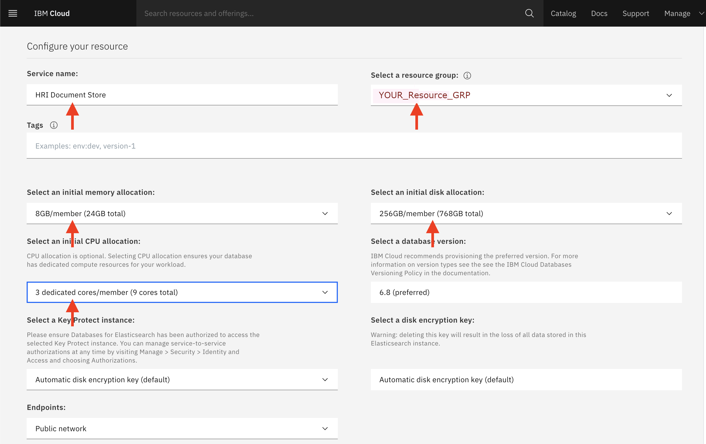
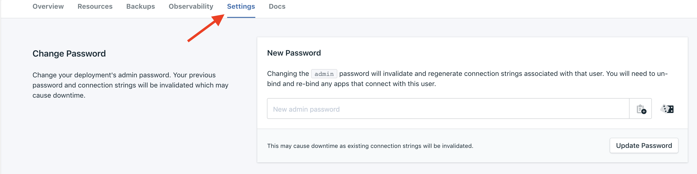
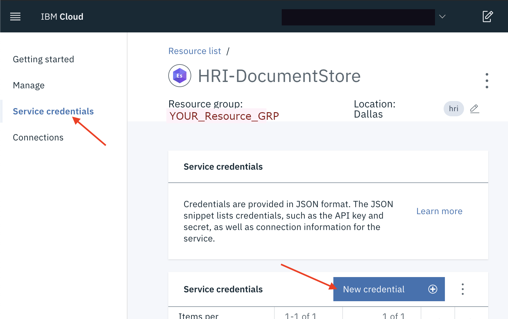
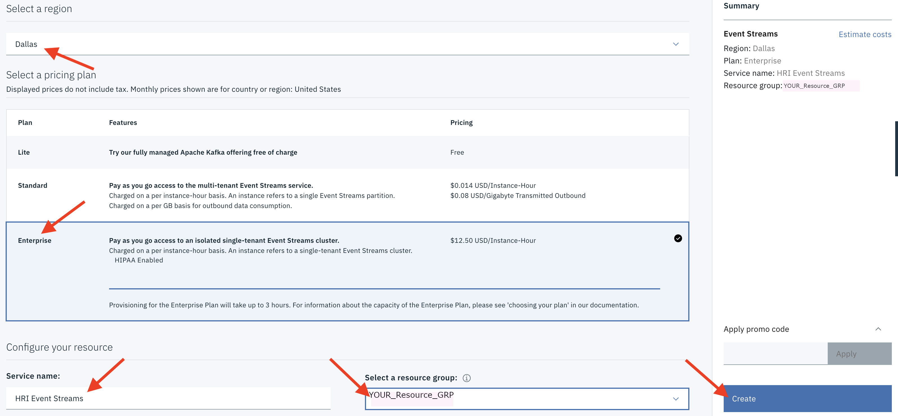
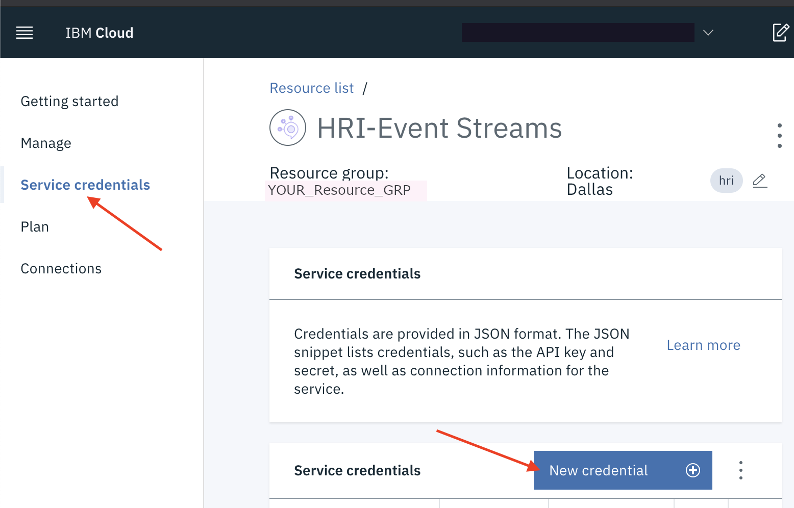

# Dependencies configuration

The information here helps you configure the dependent services that the Health Record Ingestion service uses in your own public or private IBM&reg; Cloud account.

Here are the tasks in dependency configuration:

1. [Creating an Elasticsearch cloud resource](#create-elasticsearch-cloud-resource)
2. [Creating Event Streams cloud resource](#create-event-streams-cloud-resource)

## Creating an Elasticsearch cloud resource

The Health Record Ingestion service requires an [Elasticsearch](glossary.md#elasticsearch) service deployment in your IBM Cloud account. 

 **To create an Elasticsearch cloud resource:**

1. Sign in to your IBM Cloud account.
2. Navigate to the **Resource List**, and click **Create resource**.
3. In the catalog search bar, type **Elasticsearch** as a search.
4. Select the **Databases for Elasticsearch** tile.
5. Select the appropriate **region**. 
6. Configure the resource by providing a **service name** and **resource group**.  
   
> **Note:** In configuration examples in Figure 1, the Resource Group is **YOUR_Resource_GRP**. 
7. Specify the desired resource allocations for Elasticsearch. Depending on your expected usage, your values may differ, but the values shown in Figure 1 are sufficient in most cases. Make a note of the **service name** since you might need to use the ELASTIC_INSTANCE parameter in your deployment process. 
8. Click **Create**.

**Figure 1: Setting up an Elasticsearch cloud resource**

9. After the Elasticsearch instance becomes active, set an admin password. Do this on the Settings page of the Elasticsearch instance.
   

10. In the left navigation, click **Service credentials**.
11. On the page that appears, Next to **Service credentials**, click **New credential**. 

**Figure 2: Setting up service credentials**

12. On the page that appears, type a name for the service credential and then add it. Make a note of this name since you might need to use the *ELASTIC_SVC_ACCOUNT* parameter during deployment.

## Creating an Event Streams cloud resource

The Health Record Ingestion service also requires an [Event Streams](glossary.md#event-streams) service deployment in your IBM Cloud account.

 **To create an Event Streams cloud resource:**
1. Sign in to your IBM Cloud account.
2. Navigate to the **Resource List**.
3. If an instance of Event Streams already exists in your Cloud account, then the Health Record Ingestion service might be able to share that existing instance. 
4. If an Event Streams instance does not already exist, then create one by clicking **Create resource**. 
5. In the catalog search bar, type **Event Streams** as a search.
6. Select **Event Streams** tile.
7. Select the appropriate **region**, **service name**, and **resource group**.
  
> **Note:** For HIPAA data processing, the **Enterprise** pricing plan (with custom key management via Key Protect) is required. 

8. After creating an **Enterprise** instance of Event Streams, custom key management via Key Protect will need to be explicitly enabled (See [Event Streams documentation](https://cloud.ibm.com/docs/services/EventStreams?topic=eventstreams-managing_encryption#enabling_encryption)).
9. Make note of the **service name** since you might need to use this *EVENT_STREAMS_INSTANCE* parameter during deployment.
10. Click **Create**.

**Figure 3: Setting up an Event Streams cloud resource**

11. In the left navigation, click **Service credentials**.
12. On the page that appears, Next to **Service credentials**, click **New credential**.
13. Create a service credential with **writer** permissions. Provide a name for the service credential and then add it. Make a note of this name because you might need this *EVENT_STREAMS_SVC_ACCOUNT* parameter during deployment.

**Figure 4: Setting up service credentials**

***

**Note**: You will need to create and develop your own deployment process/scripts for the Management API that deploys it successfully to your [IBM Cloud Functions](glossary.md#ibm-cloud-functions) instance. To enable their deployments, the IBM Watson Health team created a custom Travis Continuous Integration (CI) job. 

---

## Next steps

For steps to set up your first [tenant](glossary.md#tenant) and [Data Integrator](glossary.md#data-integrator), see [Administration](admin.md). 

To learn how tenants and the Data Integrator role are the basis of the Health Record Ingestion service's multi-tenancy approach, see [Multi-tenancy](multitenancy.md).
