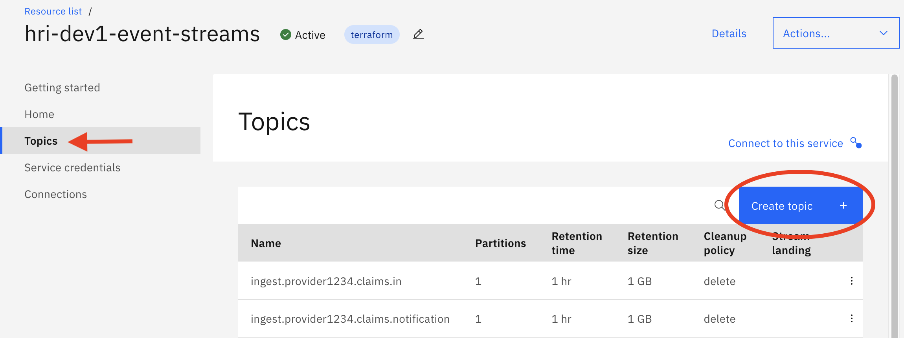
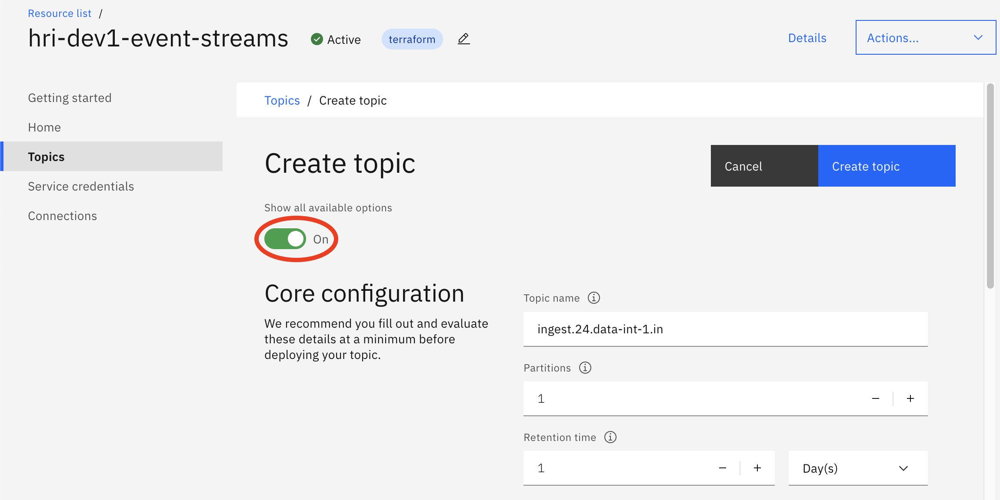
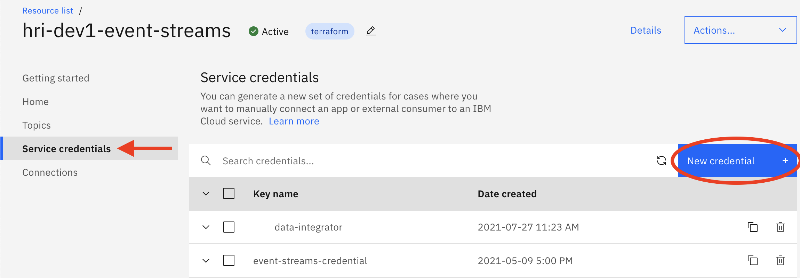
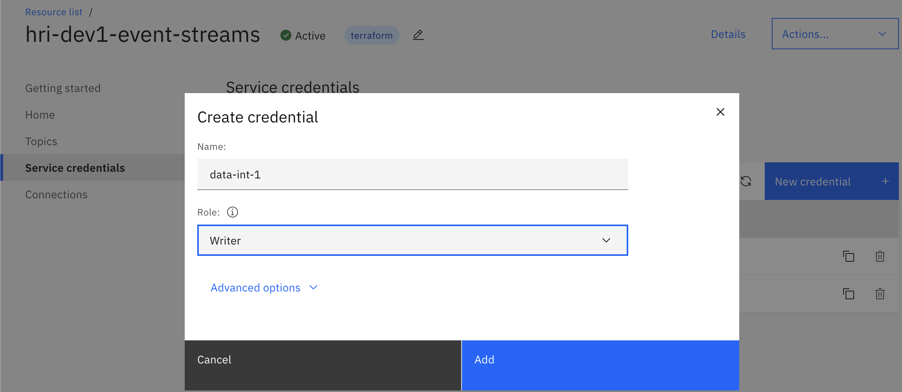
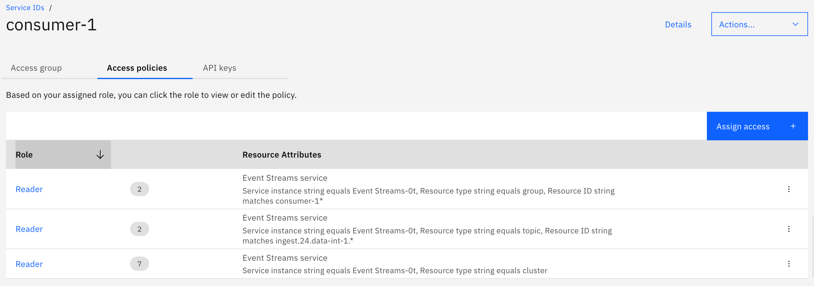
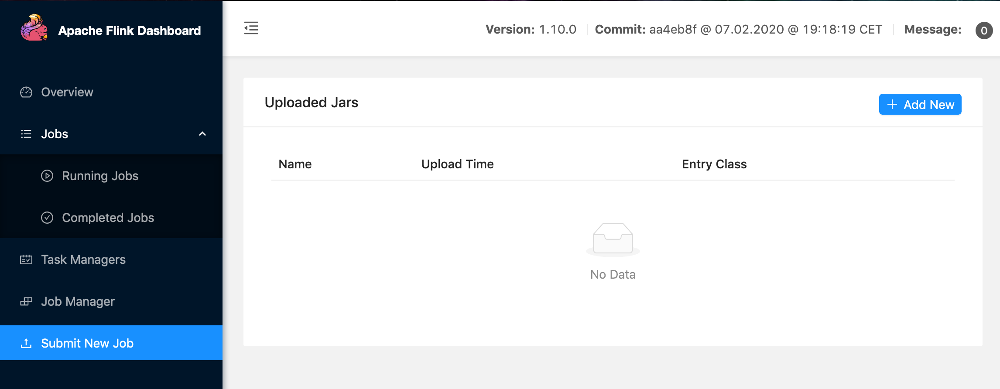
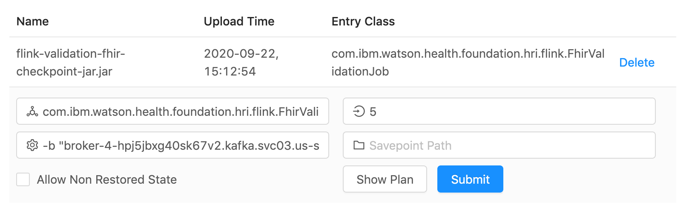

# HRI Administration

HRI Administration tasks include: 

  1. [Managing Tenants](#managing-tenants)
  2. [Onboarding Data Integrators](#onboarding-new-data-integrators)
      1. [Manually through the Event Streams UI](#manually-through-the-event-streams-ui)
      2. [Using the Management API Stream Endpoints](#using-the-management-api-stream-endpoints)
  3. [Validation Processing](#validation-processing)
  4. [HRI Management User Authorization](#hri-management-user-authorization)
   
## Managing Tenants
Every [Tenant](glossary.md#tenant) has a separate index in [Elasticsearch](glossary.md#elasticsearch). Indexes are named `<tenantId>-batches`. For example, if the tenant ID is `24`, the new index name will be `24-batches`. Some solutions may include a `tenant` prefix, e.g. `tenant24-batches`. The tenant ID may contain any lowercase alphanumeric strings, `-`, and `_`. Whatever pattern you use, this will determine the tenant ID path parameter required in most of the Management API [endpoints](apispec.md), and will need to be communicated to Data Integrators for that tenant. If you are using an existing deployment, check with team managing the instance on naming conventions.

There are four Management API endpoints that support Tenant management in Elasticsearch for HRI: Create, Get (all tenants), Get (specific tenant) and Delete. Please note that all four of these endpoints require IAM authentication - you will need to pass in an IAM Bearer token as part of the authorization header in the requests.

#### Create Tenant
Use the Management API Create Tenant endpoint to create new Tenants. This will create a new index for the Tenant in Elasticsearch. The `Create` Tenant endpoint takes in one path parameter `tenantId`, which may only contain lowercase alphanumeric characters, `-`, and `_`. For example, for the `tenantId` "24" you would use the following curl command:

    curl -X POST \
      <hri_base_url>/tenants/24 \
      -H 'Accept: application/json' \
      -H 'Authorization: Bearer <token>' \
      -H 'Content-Type: application/json' 
    
#### Get Tenants
The `Get` endpoint takes in no parameters and returns a list of all tenantIds that have an Elastic index. Assuming the above Create was run, then the following cURL command (HTTP/Get operation) would return a list containing the single tenantId "24":

    curl -X GET \
      <hri_base_url>/tenants \
      -H 'Accept: application/json' \
      -H 'Authorization: Bearer <token>' \
      -H 'Content-Type: application/json'
             
#### Get Tenant
The `GetTenant` endpoint can also take in a `tenantId` and will return a list of information on the associated index. Assuming the above Create was run, then the following cURL command (HTTP/Get operation) would return a list of information on the index for "24":

    curl -X GET \
      <hri_base_url>/tenants/24 \
      -H 'Accept: application/json' \
      -H 'Authorization: Bearer <token>' \
      -H 'Content-Type: application/json'

#### Delete Tenant
Like `Create`, the `Delete` Tenant endpoint takes in `tenantId`. The following curl command will delete the elastic index for `24`:
      
    curl -X DELETE \
      <hri_base_url>/tenants/24 \
      -H 'Accept: application/json' \
      -H 'Authorization: Bearer <token>' \
      -H 'Content-Type: application/json' 

## Onboarding New Data Integrators
Every unique combination of Tenant and [Data Integrator](glossary.md#data-integrator) must have a separate 'stream', path of data through the HRI, in order to satisfy HIPAA data isolation requirements. See [Multi-tenancy](multitenancy.md) for more details. Every stream includes two or four topics, depending on whether validation is enabled, and topics can be added manually through the Event Streams UI and API or automatically through the Management API.

### Topic Naming Conventions: 
Please note that HRI uses the following naming conventions for topics:

  1. `ingest.<tenantId>.<dataIntegratorId>[.metadataTag].in`
  2. `ingest.<tenantId>.<dataIntegratorId>[.metadataTag].notification`
  3. `ingest.<tenantId>.<dataIntegratorId>[.metadataTag].out`
  4. `ingest.<tenantId>.<dataIntegratorId>[.metadataTag].invalid`

The `metadataTag` is an optional field that can be set to any user defined value. For example, with tenant id `24`, Data Integrator id `data-int-1`, and metadata tag `claims`, the topics would be:

  1. `ingest.24.data-int-1.claims.in`
  1. `ingest.24.data-int-1.claims.notification`
  1. `ingest.24.data-int-1.claims.out`
  1. `ingest.24.data-int-1.claims.invalid`
  
The tenant ID must be consistent with the Elasticsearch [index tenant ID](#managing-tenants). Only use lowercase alphanumeric characters, `-`, and `_`. **Note:** the `*.out` and `*.invalid` topics are only present when validation is enabled.

### Topic Sizing Recommendations
Topic sizing mainly consists of the number of partitions and the retention policy (time and amount of data), and mainly depends on three factors:
 
* the size of batches
* the frequency of batches
* the throughput of Data Consumers

The number of partitions determines how many Data Consumer processes can read and process the data in parallel, with one process per partition. The retention policy determines how much data the topic will store before removing it due to time or size constraints. The throughput of Data Consumers is mainly dependent on what is done with the data after reading it. At a minimum, the Data Consumers must be faster than the long term rate of incoming data. Otherwise, data may be removed from the topic before it is consumed, resulting in data loss. For example, if a 10 GB batch is written by Data Integrators every 4 hours, the Data Consumers must have a process rate greater than 2.5 GBs per hour. Otherwise, they will continually fall behind and eventually not process some data before it is removed from the topic. 

For initial sizing, estimate the peak data load size (could include multiple batches depending on your solution) and divide by 1 GB (compressed) to get the number of partitions. For example, if the peak data load is 10 GBs, then start with 10 partitions. Also set the retention size to 10 GBs. In production environments, the retention time is typically 3-7 days. With longer times, you may need to also increase the retention size.

As the frequency and size of data loads increase, the number of partitions and retention policy should also increase. As the throughput of Data Consumers increases, the number of partitions and retention policy should decrease. See [Performance Testing](performance.md) for additional details on our performance tests. 

**NOTE:** if creating topics manually, only 1 partition is needed for the `*.notification` and `*.invalid` topics.

### Manually through the Event Streams UI
Create the required Kafka topics described above using the IBM Cloud Event Streams UI.

#### Create the new Topic
To Create the new topics, in your IBM Cloud account navigate to your Event Streams service. Click on the **Topics** tab/link on the left of your screen. Next, click on the "Create Topic" button on the upper right-hand side of the screen:

Enter your topic name, as defined by the naming conventions above, the number of partitions, and the retention time. Note that you must toggle **Show all available options** to see the partition and retention policy options. 

### Using the Management API stream endpoints
There are three Management API `Stream` endpoints: `Create`, `Get`, and `Delete`. Please note that all three of these endpoints require IAM authentication - you will need to pass in an IAM Bearer token as part of the authorization header in the requests. 

In the case of `Create` and `Delete`, the IAM bearer token must be associated with a user who has Manager role permissions. For `Get`, the bearer token must be associated with a user who has at least Reader role permissions. See [Event Streams documentation](https://cloud.ibm.com/docs/EventStreams?topic=EventStreams-security#assign_access) for details on permissions.

#### Create Stream
Instead of manually creating the topics for the Tenant and Data Integrator pairing, you may choose to use the Management API Create Stream endpoint which will create the topics for you, and take into account if validation is enabled.

The `Create` Stream endpoint takes in two path parameters, `tenantId` and `streamId`, where `streamId` is made up of the Data Integrator ID and an optional qualifier, delimited by '.'. Both `tenantId` and `streamdId` may only contain lowercase alphanumeric characters, `-`, and `_`. `streamdId` may also contain one '.'. For example, for the `tenantId` "tenant24", Data Integrator ID "data-int-1" and optional qualifier "qualifier1", you could use the following curl command:

    curl -X POST \
      <hri_base_url>/tenants/tenant24/streams/data-int-1.qualifier1 \
      -H 'Accept: application/json' \
      -H 'Authorization: Bearer <token>' \
      -H 'Content-Type: application/json' \
      -d '{
        "numPartitions":1,
        "retentionMs":86400000
      }'

This will create the following topics:

  1. `ingest.tenant24.data-int-1.qualifier1.in`
  2. `ingest.tenant24.data-int-1.qualifier1.notification`
  3. `ingest.tenant24.data-int-1.qualifier1.out`
  4. `ingest.tenant24.data-int-1.qualifier1.invalid`
  
**Note:** 

- `numPartitions` and `retentionMs` topic configurations are required. There are other optional configurations that can also be passed in, see the [Stream Api Spec](apispec.md#streams) for more details on these optional fields. 
- The `numPartitions` parameter is applied to the `*.in` and `*.out` topics, but the `*.notification` and `*.invalid` topics are set to 1.
- `*.out` and `*.invalid` topics are only created when validation is enabled

#### Get Streams
The `Get` Streams endpoint takes in `tenantId` as a path parameter, and returns a list of all `streamId`'s associated with that tenant. Assuming the above Create was run, then the following cURL command (HTTP/Get operation) would return a list containing the single streamId `data-int-1.qualifier1`:

    curl -X GET \
      <hri_base_url>/tenants/tenant24/streams \
      -H 'Accept: application/json' \
      -H 'Authorization: Bearer <token>' \
      -H 'Content-Type: application/json'
             
#### Delete Stream
Like `Create`, the `Delete` Stream endpoint takes in two path parameters, `tenantId` and `streamId`. The following curl command will delete both the `ingest.tenant24.data-int-1.qualifier1.in` and `ingest.tenant24.data-int-1.qualifier1.notification` topics:

    curl -X DELETE \
      <hri_base_url>/tenants/tenant24/streams/data-int-1.qualifier1 \
      -H 'Accept: application/json' \
      -H 'Authorization: Bearer <token>' \
      -H 'Content-Type: application/json' 

Note that HRI topic naming conventions require topics to start with the prefix "ingest" and end with the suffix "in", "notification", "out", or "invalid". Both the Get and Delete endpoints will ignore any topics that don't follow this convention.

### Creating Service Credentials for Kafka Permissions
You have to create an Event Streams (Kafka) Service Credential for every client that will need to read from or write to one or more topics. Typically, every [Data Integrator](glossary.md#data-integrator) and downstream [Data Consumer](glossary.md#data-consumer) will need their own service credential. A service credential can be configured with IAM policies to just grant read and or write access to specific topics and consumer groups, so only one service credential is needed for each entity. You do **_not_** need to create a service credential for every topic.

Each service credential will initially have read or write access to all topics when created depending on whether the 'Reader' or 'Writer' role is selected respectively. But they can be configured with IAM policies to just grant read and or write access to specific topics and consumer groups regardless of which role is selected. It's good practice to select 'Writer' for Data Integrators and 'Reader' for downstream consumers.

To create a service credential, navigate to the Event Streams - Service Credentials page, and then click on the "New Credential" button on the right-hand side of your screen:

You can see in the Screenshot below an example of creating a Data Integrator service credential with the _Writer_ role:  

    
Next, go to the IBM Cloud (Access) IAM Management tools to further restrict the service credential, by using the "Manage" drop-down menu at the top of your screen and choosing 'Access (IAM)'. Then select 'Service IDs' from the left menu. 

Next select the Service ID for the credential you created. If you selected 'Auto Generate' when creating the credential, it will have the same name, but be careful, because there can be multiple Service IDs with the same name. After selecting the Service ID, go to the 'Access policies' tab. You should see one policy that is created by default, which allows read or write access to all topics. To restrict access to particular topics, you have to modify the existing policy and create several new ones. Below are rules about what policies to create for specific access.

1. Create a policy with 'Reader' service access and 'Resource type' set to `cluster`. This will allow the Service ID to access the Event Streams brokers.
1. To allow read & write permissions to a particular topic, create a policy with 'Reader' and 'Writer' service access, 'Resource type' set to `topic`, and 'Resource ID' set to the topic name.
1. To allow just read permissions to a particular topic, create a policy with 'Reader' service access, 'Resource type' set to `topic`, and 'Resource ID' set to the topic name.
1. To allow subscribing to topics, the Service ID must be given permissions to create consumer groups. This is the standard way of consuming messages from Kafka. Create a policy with 'Reader' service access, 'Resource type' set to `group`, and 'Resource ID' set to a unique ID for this client followed by a `*` using 'string matches', e.g. `data-int-1*`. This allows the client to only create consumer groups that begin with this ID when connecting to Event Streams. This also prevents clients who are reading from the same topics from interfering with each other. 
1. To allow the use of [transactions](https://www.confluent.io/blog/transactions-apache-kafka/) when writing to topics, create a policy with 'Writer' service access and the 'Resource type' set to `txnid`. We highly encourage the use of transactions for exactly-once write semantics. Duplicate messages will cause validation failures or problems for downstream consumers.  

**Note**: policies support wildcards at the beginning and/or end of the 'Resource ID' field when using the 'string matches' qualifier. This enables _a single policy to allow access to multiple topics_ when they share a common substring. For example, `ingest.24.data-int-1.*` could be used to allow access to the `ingest.24.data-int-1.in`, `ingest.24.data-int-1.notification`, `ingest.24.data-int-1.out`, and `ingest.24.data-int-1.invalid` topics.

The Data Integrator will need read & write access to the input topic, but only read access to the notification topic. This requires five IAM policies total. Below is an example.

A downstream consumer will need just read access to the input and notification topics. This requires three IAM policies total. Below is an example.

More detailed documentation on how to configure IAM policies for Event Streams [can be found here](https://cloud.ibm.com/docs/EventStreams?topic=EventStreams-security). 

## Validation Processing
When Validation is enabled, every stream has a Flink job that performs the validation processing. When new streams are created, a validation Flink job also has to be created. See [Validation](validation.md) and [Processing Flows](processflow.md) for more details.

The standard HRI deployment comes with two validation jobs:

- FHIR Validation - this job validates that every record meets the [FHIR v4.0.1](https://hl7.org/fhir/resourcelist.html) Bundle json schema. The [IBM FHIR Server's FHIR model](https://ibm.github.io/FHIR/guides/FHIRModelGuide) is used for validation.
- Passthrough Validation - this job does not perform any record validation and simply passes records to the `*.out` topic

Note that all validation jobs also validate that the batch has the correct number of records. Solutions can also create their own custom Flink validation jobs, see [Validation](validation.md) for more details.

### Job parameters
The standard HRI validation jobs have the following parameters:

| Flag | Description |
|------|-------------|
| `-b`, `--brokers` | Comma-separated list of Kafka brokers |
| `-i`, `--input` | Kafka input topic |
| `-p`, `--password` | Kafka password |
| `-d`, `--batch-completion-delay` | Amount of time to wait in milliseconds for extra records before completing a batch. Optional, and defaults to 5 minutes. |
| `-m`, `--mgmt-url` | Base Url for the Management API, e.g. https://hri-mgmt-api/hri |
| `-c`, `--client-id` | `clientId` for the HRI Internal Application associated with this job and defined in the OAuth service. More information on HRI Internal Applications can be found [here](auth.md#hri-internal-application-setup).|
| `-s`, `--client-secret` | `secret` key for the HRI Internal Application defined in the OAuth service. More information on HRI Internal Applications can be found [here](auth.md#hri-internal-application-setup).|
| `-a`, `--audience` | Audience for getting OAuth access tokens. For AppId this should be set to the HRI Application `clientId`|
| `-o`, `--oauth-url` | Base Url for the OAuth service. |

### Managing Flink Jobs
There are several administrative tasks that may need to be performed including: 

- creating new jobs
- scaling jobs
- stopping and resuming jobs
- upgrading jobs 

There are several ways to perform these tasks: the UI, the Rest API, and a CLI. We recommend solutions use the Rest API to automate tasks such as creating new Flink jobs for new streams. Below we will describe each of these options.

#### Flink Rest API
Flink has a full featured REST [API](https://nightlies.apache.org/flink/flink-docs-release-1.14/docs/ops/rest_api/), which we encourage solutions to use for automation. Here are some useful endpoints:

- [GET `/jars`](https://nightlies.apache.org/flink/flink-docs-release-1.14/docs/ops/rest_api/#jars) - returns a list of all the uploaded jars
- [POST `/jars/upload`](https://nightlies.apache.org/flink/flink-docs-release-1.14/docs/ops/rest_api/#jars-upload) - uploads a new jar
- [POST `/jars/:jarid/run`](https://nightlies.apache.org/flink/flink-docs-release-1.14/docs/ops/rest_api/#jars-jarid-run) - starts a new job
- [POST `/jobs/:jobid/stop`](https://nightlies.apache.org/flink/flink-docs-release-1.14/docs/ops/rest_api/#jobs-jobid-stop) - stops a job and creates a savepoint. Set `drain` to `true` to allow the job to finish processing any in-flight data.

#### Do Not Cancel Flink Jobs
The Flink Rest API contains a [PATCH `/jobs/:jobid`](https://nightlies.apache.org/flink/flink-docs-release-1.14/docs/ops/rest_api/#jobs-jobid-1) endpoint that can cancel Flink jobs. This endpoint will not gracefully shutdown HRI validation jobs, and overusing it can cause an Out of Memory error. If a job needs to be stopped, call the [POST `/jobs/:jobid/stop`] endpoint.

#### Flink UI
Flink has a UI where jars can be viewed, uploaded, and run, but has limited support for rescaling jobs and creating savepoints.

To view a list of jars, select 'Submit New Job' from the right menu. Click '+ Add New' to upload a new jar.

To start a new job, select a jar from the list and fill in the parameters. Put the job parameters in the 'Program Arguments' field. You can also set the parallelism or enter a savepoint path to start from a prior job's savepoint.

#### Flink CLI
Flink has a [CLI](https://nightlies.apache.org/flink/flink-docs-release-1.14/docs/deployment/cli/) that can be used to manually perform tasks or automate them. It supports all actions needed for managing jobs and savepoints but does not include all the monitoring endpoints of the REST API. It also has to be configured correctly to communicate with the Flink cluster.

## HRI Management User Authorization
In your authorization service, create a new scope for this tenant and assign it to the Data Integrators and Consumers that need access. See [Authorization](auth.md) for more details. 

If you are using the IBM App ID Service, please see [Authorization - "Adding Data Integrators and Consumers"](auth.md#adding-data-integrators-and-consumers).
