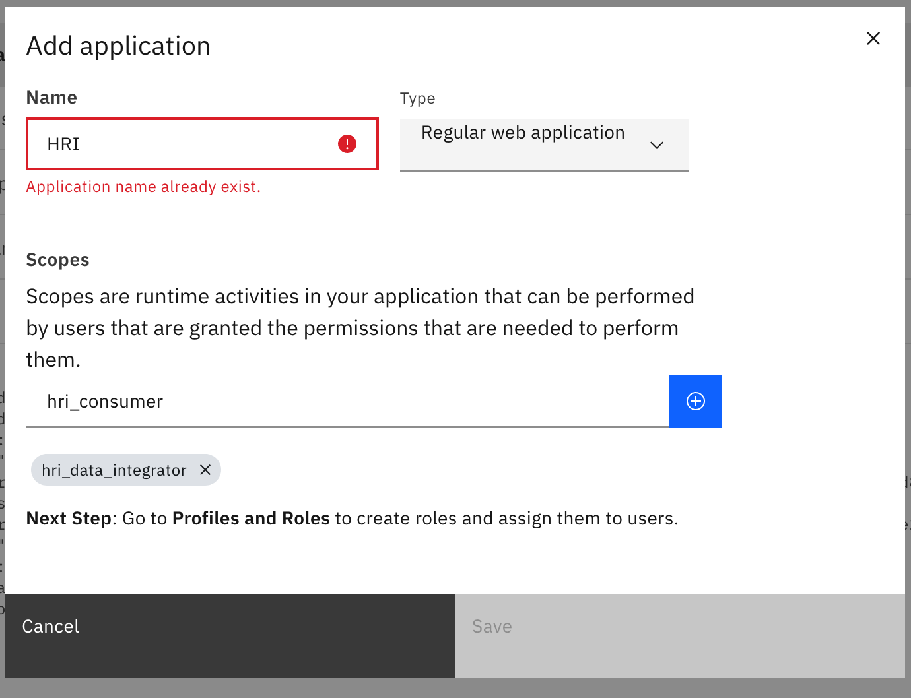
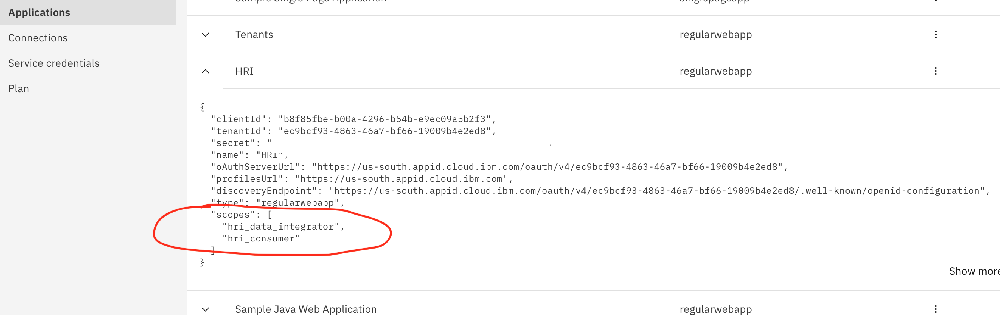
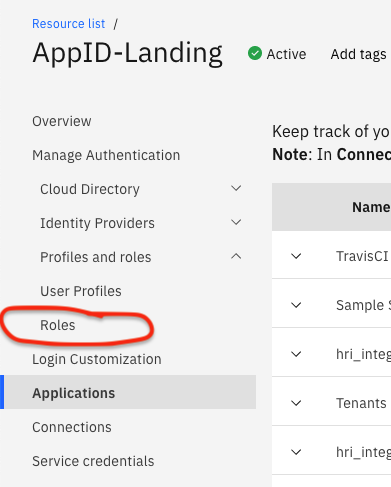
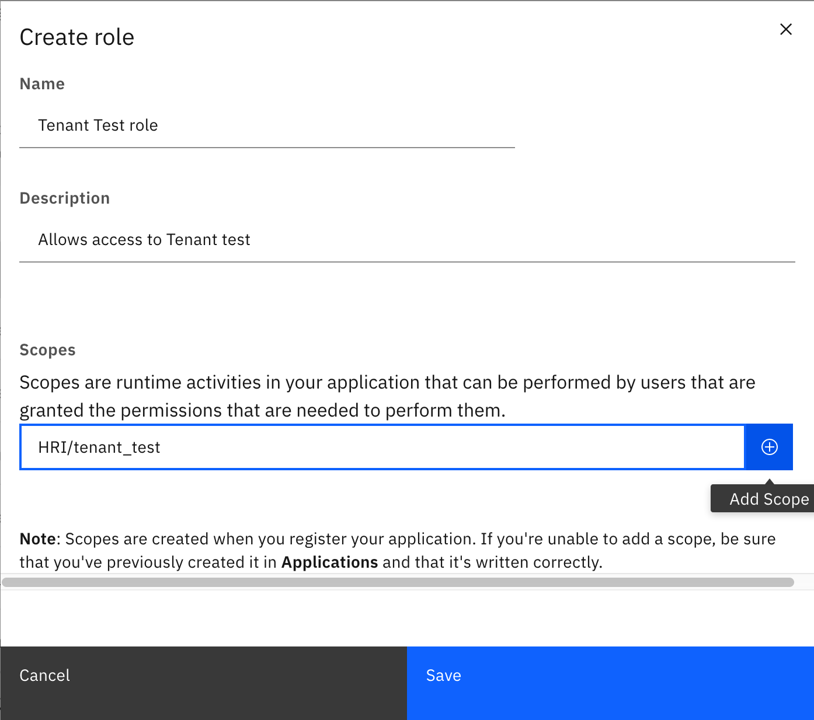
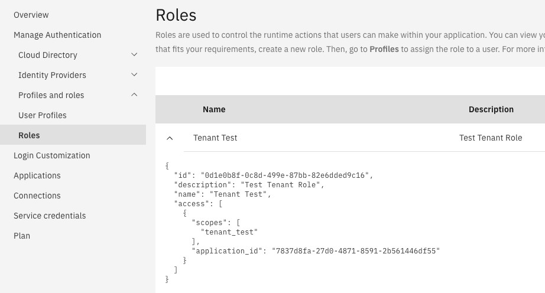
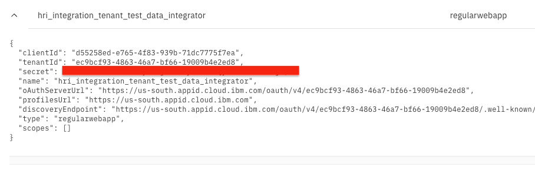
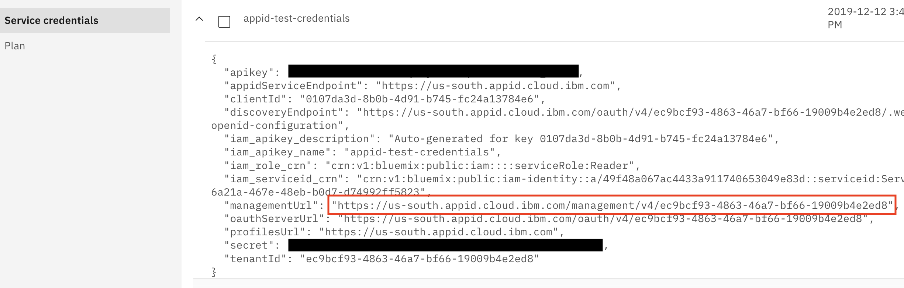

# Authorization

## Apache Kafka Authorization
Apache Kafka supports several [types of authentication](https://kafka.apache.org/documentation/#security_overview), but managed cloud services tend to limit it to one or two methods and implement their own authorization mechanism. For IBM Event Streams, see their [connecting](https://cloud.ibm.com/docs/EventStreams?topic=EventStreams-connecting) and [security](https://cloud.ibm.com/docs/EventStreams?topic=EventStreams-security) documentation and our [administration](admin.md) page for more details.

## HRI Management API
The Management API uses [OAuth 2.0](https://oauth.net/2/), [OIDC](https://openid.net/connect/), and [JWT](https://tools.ietf.org/html/rfc8693) standards for authorization.  The specific types of authorization [tokens](https://csrc.nist.gov/glossary/term/token) used by the Management API endpoints are as follows:

| Endpoint    | Path                          | Authorization Requirements |
| ----------- | ----------------------------- | -------------------------- |
| tenant      | `/tenants`                    | require IAM tokens with permissions to the Elasticsearch instance |
| stream      | `/tenants/<tenantId>/streams` | require IAM tokens with permissions to the Event Streams instance |
| batch       | `/tenants/<tenantId>/batches` | are optionally authorized by using JWT tokens from an OIDC-compliant authorization service, or with a custom authentication proxy service.  [More details on batch endpoint authorization below.](#batch-endpoint-authorization) |
| healthcheck | `/healthcheck`                | __does not__ require any authorization |

### Batch Endpoint Authorization
Regarding batch endpoint authorization with JWT Tokens, the HRI does not include an authorization or authentication service, so users must provide one themselves and configure it as per the specification below. Oauth 2 and OIDC are widely used standards which allow solutions to use their own authorization & authentication. Your token issuer must be OIDC compliant, because the OIDC defined well-known endpoints are how the Management API will validate access tokens. HRI uses IBM Cloud App ID for its reference implementation of an OIDC-compliant authorization service. There are instructions provided below for how HRI users can configure their own instance of IBM Cloud App ID.

### Required Token Scopes:
You must configure your authorization service to include HRI roles and tenant [scopes](https://oauth.net/2/scope/) in the access tokens (Note: `scope` is a standard claim that is a space-separated list of strings).

#### HRI Role Scopes:
* `hri_data_integrator` - Data Integrator role; allows access to create, query, and update batches. Results are filtered to batches that the Data Integrator created. Note that the `sub` claim in the access token is used to identify the Data Integrator and stored in the batch `integratorId` field.
* `hri_consumer` - Data Consumer role; allows access to query batches. Results are not filtered.

#### Tenant Scopes
A Tenant scope matching the _tenant ID_ is required every time you call a "batch" endpoint in the Management API. The scope must have `tenant_` as a prefix to the tenant ID.

For example, if a data integrator tries to create a batch by making an HTTP POST call to `tenants/24/batches`, the token must contain scope `tenant_24`, where the `24` is the tenantId.

Also, see [Multi-tenancy](multitenancy.md) for more information about tenants and roles. See the API [spec](https://github.com/Alvearie/hri-api-spec/blob/support-1.x/management-api/management.yml) for more details about required roles for specific endpoints.


### Configuring the Token Issuer
The token issuer is a configuration parameter of the Management API, and only one issuer may be set. The issuer must match the `iss` claim in the access token.  See [deployment](deployment.md) for more details.

## Using App ID as Your Authorization Service
[IBM Cloud App ID](https://www.ibm.com/cloud/app-id) is an IBM Cloud managed authorization and authentication service. App ID supports custom claims/scopes for client credentials by creating 'Applications' with scopes and assigning them to other 'Applications' via roles.

Below are the manual steps to configure App ID for your reference, but you will probably want to automate some or all of these steps for your solution using the App ID [API](https://us-south.appid.cloud.ibm.com/swagger-ui). (Note all examples here will be of the AppID-Landing App ID service instance.)

### Initial Configuration

1. Create an **"HRI"** Application and its associated scopes. This application represents the HRI as a 'protected' resource (API) that other clients will be granted permissions to access. It is not a client that will connect to the HRI, and it's credentials should never be used.

* After opening your App ID service instance in your cloud account, note the App ID actions menu on the left-hand side of your screen:

  


* Click on the "Applications" menu item to see the Applications Screen:

  


* Click on the blue "Add application" button on the top-right of the screen:

  


* Enter the Name (`HRI`), keep the default _Type_ of "Regular web application" and add both of the required scopes using the "+" button (`hri_data_integrator`, `hri_consumer`; see HRI Scopes above) and click the "Save" button:

  


* Now you should be able to view your newly created "HRI" Application, and it's details (note: that you will now see the two scopes in the "scopes" section):

  


***

2. Create **Tenant** scopes:

* In the App ID "Applications" screen, find the "HRI" Application created in step 1 above. Expand It's "..." menu on the far right and select "Edit".

  

* Using the scopes "+" button, create a scope with the naming convention `tenant_<tenantId>` for every current tenant in your solution, then click the "Save" button.

  

  Please note that we added a scope named "tenant_test", where the `test` portion of this scope string exactly matches the actual Tenant Name that was created when [Adding/Creating the new tenant](admin.md#managing-tenants):

  

***

3. Create new roles for each of the scopes you created in steps 1 & 2. You will create roles for the HRI role scopes and for every existing Tenant in your solution.

* Click on the "Profiles and roles" sub-menu (under "Manage Authentication") and then on the "Roles" sub-menu under that:

  

* Click on the blue "Create Role" button on the top-right of the screen. Enter a role name and description (optional). In the "Scopes" field, enter the HRI Application name followed by a '/' and then the scope name. Then click the "+" button. Each role will have a 1-to-1 relationship with one scope. Last, click the "Save" button. Below is example for the "test" Tenant role:

  


* A example "test" Tenant role:

  


* An example HRI Data Integrator role:

  


* An example HRI Consumer role:

  

### Adding Data Integrators and Consumers

1. Create a new Application for every HRI client (Data Integrator or Data Consumer) that uses the Management API.

   For example, here is a screenshot that includes five (5) different user-instance Applications created for the HRI Integration Test (client):

   

   An example of what one of these new Applications would look like after created:

   

   Please note that the "scopes" property is empty and that this new "credential" Application has been created for the "tenant_test" and a "data integrator". Hence, in Step 2 below, it will have the roles of "Tenant Test" and "HRI Data Integrator" assigned to it.

***

2. Assign roles to each of the Credential Applications you created in step 1 to grant access to the HRI and specific tenants. Currently, this can only be done via making HTTP calls directly to the App ID API, specifically the endpoint `/management/v4/{tenantId}/applications/{clientId}/roles` (see [App ID API Specification](https://us-south.appid.cloud.ibm.com/swagger-ui/#/Management%20API%20-%20Applications) section "Management API - Applications").

   For example, if you have just created a new Data Integrator credential Application, assign the HRI Data Integrator role, as well as a role for **every tenant** that data integrator produces data for, by taking the following actions:

* Using the command-line, Login to the IBM CLI and obtain an OAuth token:

      ibmcloud iam oauth-tokens

  That will return a message like this:

      IAM token:  Bearer eyJraWQi.......{Very long string}

* Next, export that long string (starting after the "Bearer " section) to a bash/shell variable named TOKEN:

      export TOKEN=eyJraWQi.......{Very long string}

* Compose the correct HTTP/REST endpoint URL for the Assignment API call:

    * Find the correct App ID HTTP/REST endpoint URL root for managing the instance. In service credentials, it is the value of the `managementUrl` field (e.g `https://us-south.appid.cloud.ibm.com/management/v4/ec9bcf93-4863-46a7-bf66-19009b4e2ed8`):

      

    * To complete the URL you will need to add the following:

          /applications/[client_id_of_application_assigning_to]/roles

      where "client_id_of_application_assigning_to" will be replaced with `clientId` value from the Application, such as the "hri_integration_tenant_test_data_integrator" Application. That clientId ends in `5f7ea`:

      

      The completed full example App ID HTTP PUT url would look like this:

        https://us-south.appid.cloud.ibm.com/management/v4/ec9bcf93-4863-46a7-bf66-19009b4e2ed8/applications/d55258ed-e765-4f83-939b-71dc7775f7ea/roles

* Construct your JSON string of roles that you will be associating with this "hri_integration_tenant_test_data_integrator" Application.

  For our example, as the name of our new Credential Application suggests, we will be assigning the "Tenant Test" and "HRI Data Integrator" roles to the "hri_integration_tenant_test_data_integrator" Application.

  You will need to use the "id" field value of each Role you are associating with this particular application. In our case, that means we will need the role "id"s ending in `d9c16` and `26d12`:

  

* Your roles JSON string would then look like the following:

        {"roles":{"ids":["0d1e0b8f-0c8d-499e-87bb-82e6dded9c16","8dd46d09-eb58-4881-b6bf-fd32f4d26d12"]}}

  (Note that this is a list of n-number of roles, to which you may add more role IDs.)

* Finally, you can assemble your API HTTP request. Using a tool such as [cURL](https://man7.org/linux/man-pages/man1/curl.1.html) at the command-line or [Postman](https://www.postman.com/downloads/), create your REST/HTTP request.

  Using cURL at the command-line (assumes you have curl installed; see https://curl.haxx.se/download.html):

    curl -X PUT https://us-south.appid.cloud.ibm.com/management/v4/ec9bcf93-4863-46a7-bf66-19009b4e2ed8/applications/d55258ed-e765-4f83-939b-71dc7775f7ea/roles \
      -H "Authorization: Bearer $TOKEN" \
      -H 'Content-Type: application/json' \        
      -d '{"roles":{"ids":["0d1e0b8f-0c8d-499e-87bb-82e6dded9c16","8dd46d09-eb58-4881-b6bf-fd32f4d26d12"]}}'

  Note that your roles JSON string should be surrounded by single-quotes (').

### Authorization Workflow Example
To present an example, Data Integrators and Consumers using App ID would need to **request** an access token from the App ID service using the OAuth 2.0 "client credentials" grant flow for reference, see [IBM App ID Documentation](https://cloud.ibm.com/docs/appid?topic=appid-app). The request must include the desired scopes and the HRI Application ID as the audience.

This is what an example cURL statement would look like to request the access token:

```sh
curl -X POST https://us-south.appid.cloud.ibm.com/oauth/v4/ec9bcf93-4863-46a7-bf66-19009b4e2ed8/token \
    -H 'Content-Type: application/x-www-form-urlencoded' \
    -H 'Authorization: Basic <client_id:client_password>' \
    -d 'grant_type=client_credentials&scope=tenant_test hri_data_integrator&audience=b8f85fbe-b00a-4296-b54b-e9ec09a5b2f3'

## Notes: For basic authentication you have to base64 encode the client_id and password like this

echo -n '<client_id>:<client_password>' | base64      
```


And, here is an example access token for a Data Integrator Application with access to tenant 'test', produced by App ID:

```json
{
  "iss": "https://us-south.appid.cloud.ibm.com/oauth/v4/ec9bcf93-4863-46a7-bf66-19009b4e2ed8",
  "exp": 1598459309,
  "aud": [
    "b8f85fbe-b00a-4296-b54b-e9ec09a5b2f3"
  ],
  "sub": "d55258ed-e765-4f83-939b-71dc7775f7ea",
  "amr": [
    "appid_client_credentials"
  ],
  "iat": 1598455709,
  "tenant": "ec9bcf93-4863-46a7-bf66-19009b4e2ed8",
  "scope": "tenant_test hri_data_integrator"
}
```

Note the included scope(s):

* `tenant_test`
* `hri_data_integrator`
