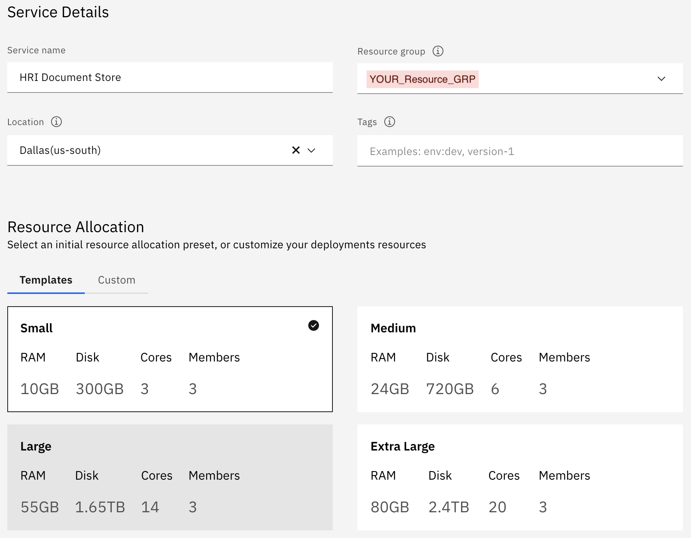
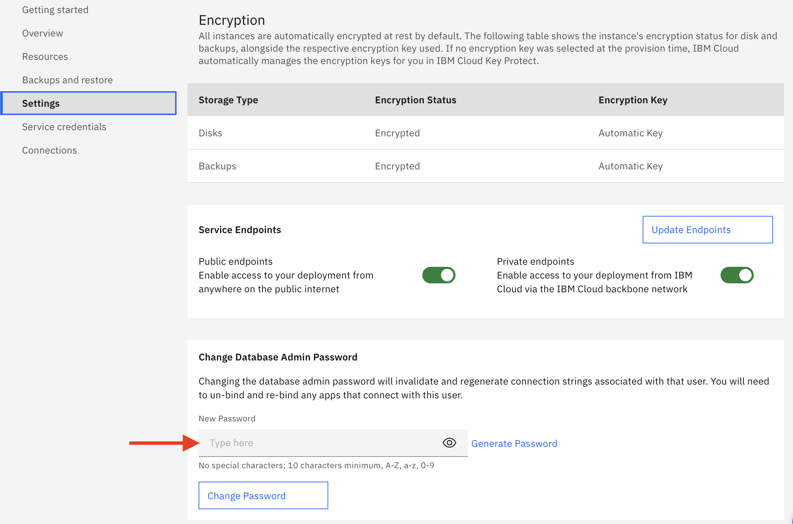
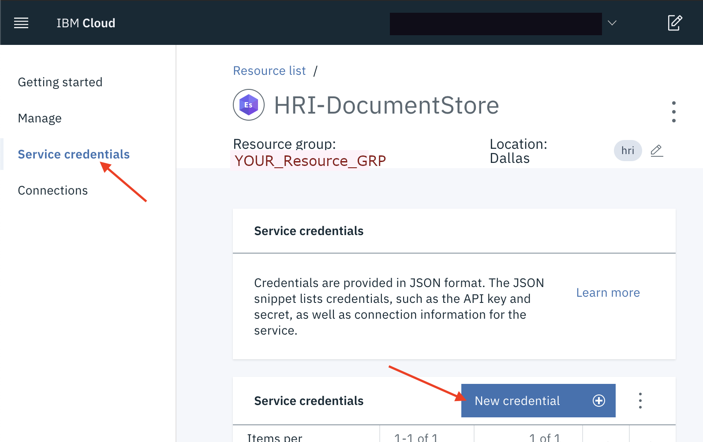
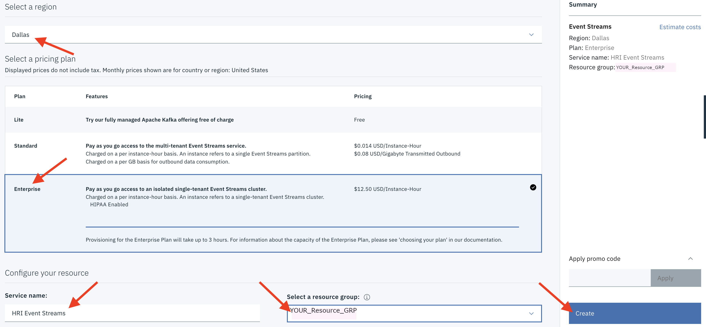

# HRI Dependencies Configuration/Setup

This section is intended to help guide you to configure the dependent services that HRI uses in your own (public/private) IBM Cloud account.

## Create Elasticsearch cloud resource

 HRI Requires an [Elasticsearch](glossary.md#elasticsearch) service deployment in your IBM Cloud account. Navigate to the **Resource List** in your Cloud account. Click the **Create resource** button in the top right corner. Enter "Elasticsearch" in the catalog search bar and then select the **Databases for Elasticsearch** tile.

 Select the appropriate **region** and then configure the resource by providing a **service name** and **resource group**  (Note: for all configuration examples below, the Resource Group is "YOUR_Resource_GRP"). 

 You will also need to specify the desired resource allocations for Elasticsearch. Depending on your expected usage, your values may differ, but the values shown below will be sufficient in most cases. Then click the **Create** button.

   

 Once the Elasticsearch instance becomes active, you will need to set an "admin" password. This is done from the **Settings** page of the Elasticsearch instance.

   

 Click the **Service credentials** link, and then click the **New credential** button. Provide a name for the service credential and then add it. This will be needed by the HRI Management API deployment.

   

## Create Event Streams cloud resource
 HRI also Requires an [Event Streams(Kafka)](glossary.md#event-streams) service deployment in your IBM Cloud account.

 Navigate to the Resource List in your Cloud account. If an instance of Event Streams already exists in your Cloud account, then the HRI may be able to share that existing instance. If an Event Streams instance does not already exist, then create one by clicking the **Create resource** button in the top right corner. Enter "Event Streams" in the catalog search bar and then select the **Event Streams** tile.

 Fill in an appropriate **region**, **service name**, and **resource group**. The **Enterprise** pricing plan (with custom key management via Key Protect) is required for HIPAA data processing. After creating an **Enterprise** instance of Event Streams, custom key management via Key Protect will need to be explicitly enabled (See [Event Streams documentation](https://cloud.ibm.com/docs/services/EventStreams?topic=eventstreams-managing_encryption#enabling_encryption)).

NOTE: The Event Streams Enterprise plan is expensive, which is why we recommend sharing an instance, if possible. In non-Production environments, a **Standard** plan may be used for testing with non-HIPAA data if your organization's security team approves.

   

 Click the **Service credentials** link, and then click the **New credential** button to create a service credential with **writer** permissions. Provide a name for the service credential. This will be needed by the HRI Management API deployment.

   

## Create Authorization Service
The HRI Management API requires an authorization service. Integration testing has been performed with [IBM Cloud App ID](https://www.ibm.com/cloud/app-id), but any compliant service can be used. See [Authorization](auth.md) for more details about the requirements and how to set up an App ID cloud service.

## Deploy the HRI Management API to Kubernetes
The Management API is packaged in a docker container for Kubernetes deployments and available on [GitHub](https://github.com/Alvearie/hri-mgmt-api/pkgs/container/hri-mgmt-api%2Fmgmt-api). The service is stateless, so you can scale up to as many pods as needed or even deploy multiple instances that use the same Elasticsearch, Kafka, and Authorization services.

The Management API process only needs a valid configuration, which can be provided by any combination of command line arguments, environment variables, and a yaml file. Conflicts are resolved in the order: command line arguments (highest priority), environment variables, and yaml file(lowest priority). Below is a table of the configuration options.

| CLI Flag | Description | Required
|:---------|:------------|:---------
|`-config-path` | Path to a config file, default "./config.yml" | 
|`-elastic-crn` | Elasticsearch service CRN | Yes
|`-elastic-url` | The base url to the Elasticsearch instance | Yes 
|`-elastic-cert` | Elasticsearch TLS public certificate | Yes
|`-elastic-username` | Elasticsearch user name | Yes
|`-elastic-password` | Elasticsearch password | Yes
|`-kafka-admin-url` | Kafka administration url | Yes
|`-kafka-brokers` | A list of Kafka brokers, separated by "," | Yes
|`-kafka-properties` | A list of Kafka properties, entries separated by ",", key value pairs separated by ":" | Yes
|`-auth-disabled` | `true` to disable OAuth Authorization, default: false |
|`-oidc-issuer` | The base URL of the OIDC issuer to use for OAuth authentication (e.g. https://us-south.appid.cloud.ibm.com/oauth/v4/<tenantId>). | If `-auth-disabled` is false.
|`-jwt-audience-id` | The ID of the HRI Management API within your authorization service. | If `-auth-disabled` is false.
|`-tls-enabled` | Toggle enabling an encrypted connection via TLS, default: false | 
|`-tls-cert-path` | Path to the TLS certificate. | If `-tls-enabled` is true.
|`-tls-key-path` | Path to the TLS key. | If `-tls-enabled` is true.
|`-new-relic-enabled` | True to enable New Relic monitoring, default: false
|`-new-relic-app-name` | Application name to aggregate data under in New Relic. | If `-new-relic-enabled` is true.
|`-new-relic-license-key` | New Relic license key. | If `-new-relic-enabled` is true.
|`-validation` | True to enable record validation, default false |
|`-log-level` | Minimum Log Level for logging output. Available levels are: Trace, Debug, Info, Warning, Error, Fatal and Panic. Default "info") |

The associated environment variable is named by removing the leading `-`, capitalizing all characters, and replacing remaining `-` with `_`. For example, the `-auth-disabled` flag has the `AUTH_DISABLED` environment variable.

Yaml file entries are named by removing the leading `-`. For example, the `-auth-disabled` flag has the `auth-disabled` yaml entry.

## Validation Processing
Validation processing is an optional feature that validates the data as it flows through the HRI. See [Validation](validation.md) for details on the validation performed and customization options. See [Processing Flows](processflow.md) for details on how it fits into the overall architecture. 

Validation processing is built on [Apache Flink](https://flink.apache.org/), a highly available stateful stream processing framework, and requires a 'Session' cluster when enabled. See their deployment [documentation](https://ci.apache.org/projects/flink/flink-docs-release-1.10/ops/deployment/kubernetes.html) for details on how to deploy a cluster. See the [Administration](admin.md) page for details about how to deploy validation jobs.

***

## What's Next
To set up your first [Tenant](glossary.md#tenant) and [Data Integrator](glossary.md#data-integrator) go to the [Administration](admin.md) page. 

For detailed info on how the concept of Tenants and the Data Integrator role underpin the HRI Multitenancy approach, see the [Multitenancy](multitenancy.md) page.
