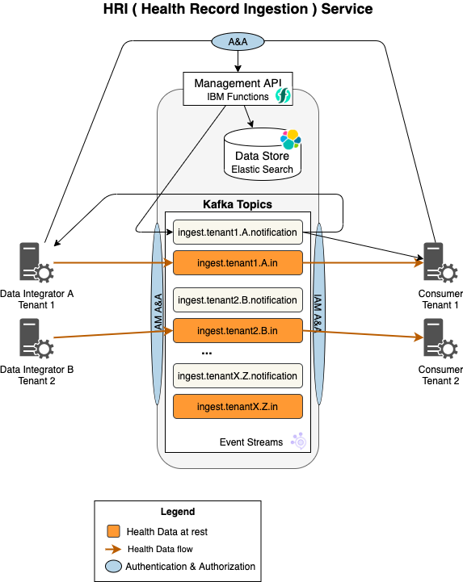

# Health Record Ingestion service

The HRI is a deployment ready service for streaming Health-related data into the IBM Cloud. It provides a "front door" for "Data Integrators" to send data into the cloud, while supporting both batch-processing and data streaming workflows. It provides features to initiate and track the movement of a dataset for both ["Data Integrators"](glossary.md#data-integrator) and ["Data Consumers"](glossary.md#data-consumer). 

The key features are:

- Streaming - all data is streamed
- Batch support - a collection of health data records can be streamed and processed together
- Multitenancy - supports segregation of data by tenant and Data Integrator

## Key Technologies
- [Event Streams](https://www.ibm.com/cloud/event-streams), an IBM Cloud-based [Apache Kafka](https://kafka.apache.org/) managed service, is the technology used for producing and consuming the data streams
- Using [IBM Cloud Functions](https://cloud.ibm.com/functions/learn/concepts), HRI exposes a Serverless RESTful Management API that is used to control and configure the system
- [Elasticsearch](https://github.com/elastic/elasticsearch) is the distributed NoSQL data store that is used to store information about batches 

## IBM Cloud Dependencies  
The HRI was developed on the IBM Cloud and currently does not support running on other public or private clouds. However, as a part of Alvearie, the goal is to support other public and private clouds, which the team continues to work towards.

## Core Architecture

### Topics
Health data, which may include [PHI](glossary.md#phi), is written to and read from the Kafka topics. There **_must be_** _separate topics for each tenant and Data Integrator_ in order to meet data separability requirements. A set of four topics is used per [Stream](glossary.md#stream) of data that flows through the HRI.

Data Integrators write data to and Data Consumers read data from the `*.in` topic. [Batch status notifications](apispec.md#notification-messages) are written to the `*.notification` topic.

### Batches
Health Record Datasets often have requirements to be processed together "as a set" (partially or in their entirety) when moving the data into the cloud. Hence, HRI has been built with support to process a dataset as a _Batch_. See [Batch](glossary.md#batch) for a detailed definition.  

How much data goes in a batch is really up to the solution. The HRI Management API provides support for starting, completing, terminating, and searching for batches. Any change to a batch results in a message being written to the associated notification topic in Kafka. 

### Data Format
HRI does not impose any requirements on the format of the Health Data records written to Kafka. There is a separate effort to define a common FHIR model for PHI data. 

However, The HRI **does require** the [`batchId`](glossary.md#batch-id) to be in the record header. Data Integrators may include any number of additional custom header values that they wish to pass onto data consumers. An example of a custom header value might be something like `originating_producer_id`, an originating data producer (or org) ID value that may need to be communicated to the data consumers. 

## Additional Reading
- [Processing Flows](processflow.md)
- [API specification](apispec.md)
- [Multi-tenancy](multitenancy.md) 
- [Deployment](deployment.md)
- [Administration](admin.md)
- [Authorization](auth.md) 
- [Monitoring & Logging](monitorlog.md)
- [Troubleshooting](troubleshooting.md)
- [Releases](releases.md)
- [Glossary](glossary.md)

## Questions
Please contact these team members for further questions: 

  * David N. Perkins, Team Lead: david.n.perkins@ibm.com
  * Aram S. Openden, Maintainer: aram.openden1@ibm.com

## Contributors
  * Alisa Kotliarova: alisa@ibm.com
  * Daniel Baxter: djbaxter@us.ibm.com
  * Fred Ricci: fjricci@us.ibm.com
