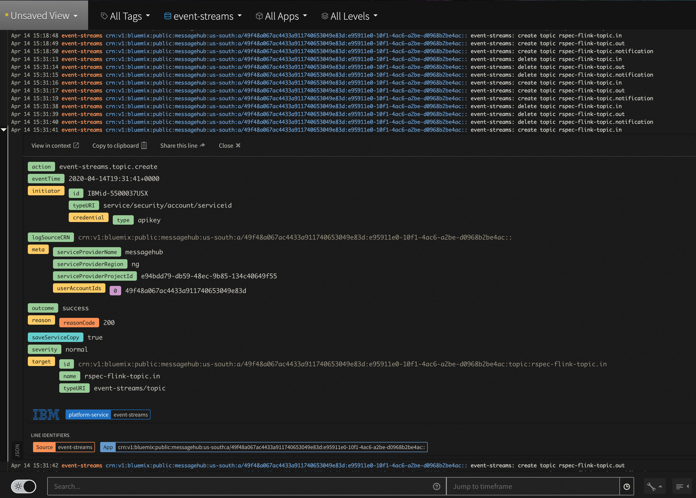

# HRI Monitoring & Logging

## HRI Management API 

### Logging
The Management API writes logs to standard out and can be configured to output these levels: Trace, Debug, Info, Warning, Error, Fatal and Panic. The default level is Info. At Info and below, every request's response code is logged. At Debug and below, the request and responses body is also logged.

In addition, every request is assigned a unique ID, which is included is most log messages and all error responses as the `errorEventId`. This helps facilitate investigation of issues with specific calls. If the client experiencing the issue can provide the `errorEventId`, the logs can be easily searched for that ID to find all relevant log messages.

### Monitoring
The Management API has two endpoints to facilitate monitoring its health.

1. There is an `/alive` that is not documented in the API specification as it not intended to be part of the exposed API. This endpoint is for Kubernetes liveness and readiness probes and ensures the [Echo web server](glossary.md#echo) is up and responding to requests. It requires no authentication and responds with a 200 code and `yes`.

2. There is an `/hri/healthcheck` endpoint that checks the health of Elasticsearch and Kafka. It requires no authentication and responds with a 200 code and an empty body on success. If there are any issues a 500 code and body describing the issue is returned.

## Event Streams

### Monitoring Topics and Consumers
Event Streams provides minimal monitoring with SysDig. Captured metrics include the number of topics, the rate of bytes written and read from each topic, stable consumers, and inactive consumers. See [Monitoring Event Streams metrics using IBM Cloud Monitoring with Sysdig](https://cloud.ibm.com/docs/EventStreams?topic=EventStreams-metrics) for more details.

### User Data Access Logging
HIPAA regulations require logging all access to [PHI data](glossary.md#phi). In the HRI, HIPAA data is only persisted in Event Streams, which will automatically log topic creation and deletion to Activity Tracker, see [Activity Tracker events](https://cloud.ibm.com/docs/services/EventStreams?topic=eventstreams-at_events) for more information. 

To view the access logs, go to the [Activity Tracker](https://cloud.ibm.com/observe/activitytracker) instance for your account. It has a LogDNA interface where you can filter logs by source and/or application. Below is a screenshot of a topic creation log entry.  

 

When using the HRI to process [PHI](glossary.md#phi), additional audit events must be enabled, which requires the Enterprise plan. Audit events for read, write, and delete actions must be enabled on the `*.in` and `*.out` Kafka topics, which will result in events being created when that action is taken on the topic. This allows an offering team to audit Event Streams events relevant to potential PHI access. Information about how to enable message audit events can be found [here](https://cloud.ibm.com/docs/EventStreams?topic=EventStreams-at_events#enable-message-events).
