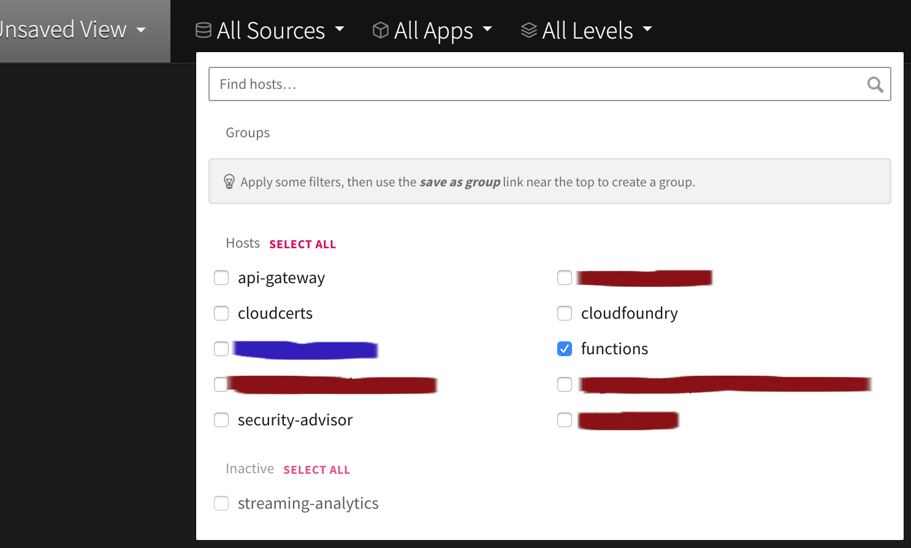

# HRI Monitoring & Logging

## HRI Management API

### Logging

#### IBM Functions Tooling
IBM Cloud Functions provides some built-in monitoring tools. On the IBM Cloud Functions main page, select the correct/appropriate [_Namespace_](https://cloud.ibm.com/docs/openwhisk?topic=openwhisk-namespaces) for your particular Management API deployment. Then select the "Activations Dashboard" link from the left-hand side menu. 

The Activations Dashboard will show recent calls (limited to 7 days) to the Management API, their response times, and failure indicators. You can click on the _`activationId` link_ for any given function invocation to view additional details. In the example below, for the `create_batch` function call, the `activationId` is the alpha-numeric identifier string starting with "21fc4f038ddb":

Clicking the `activationId` link will open up a new tab showing the details of that particular function call, including the path and any possible error event or description.

#### LogDNA
Logs from IBM Functions are also written to the LogDNA instance designated as "Platform Logs" for your Cloud account. You view the list of LogDNA instances here: https://cloud.ibm.com/observe/logging. Open the dashboard to view the logs, which will also contain messages from many other IBM Cloud services. Choose the “All Sources” menu and select the “functions” checkbox to filter only on IBM Functions log messages as seen in this Screen Cap:

The search bar at the bottom can also be used to filter for specific messages. For example, since "`batches/`" is on the path of the REST API requests for many of the Management API operations, searching for it will only show those related logs. Additionally, most error responses returned from the Management API and most logging messages within the Management API include an [errorEventId](https://github.com/Alvearie/hri-api-spec/blob/support-2.x/management-api/management.yml). The `errorEventId` in an error response for a specific API invocation will match the `errorEventId` on logging messages from the same API invocation. Searching by the `errorEventId` is a recommended tactic for troubleshooting because it can illustrate what took place during the event call which produced the error.

### Monitoring
The Management API has an `/hri/healthcheck` endpoint can that be used to monitor its health. It ensures the service is running and also checks the health of Elasticsearch and Event Streams. It requires no authentication and responds with a 200 code and an empty body on success. If there are any issues a 500 code and body describing the issue is returned.

## Event Streams

### Monitoring Topics and Consumers
Event Streams provides minimal monitoring with SysDig. Captured metrics include the number of topics, the rate of bytes written and read from each topic, stable consumers, and inactive consumers. See [Monitoring Event Streams metrics using IBM Cloud Monitoring with Sysdig](https://cloud.ibm.com/docs/EventStreams?topic=EventStreams-metrics) for more details.

### User Data Access Logging
HIPAA regulations require logging all access to [PHI data](glossary.md#phi). In the HRI, HIPAA data is only persisted in Event Streams, which will automatically log topic creation and deletion to Activity Tracker, see [Activity Tracker events](https://cloud.ibm.com/docs/services/EventStreams?topic=eventstreams-at_events) for more information. 

To view the access logs, go to the [Activity Tracker](https://cloud.ibm.com/observe/activitytracker) instance for your account. It has a LogDNA interface where you can filter logs by source and/or application. Below is a screenshot of a topic creation log entry.  

 

When using the HRI to process [PHI](glossary.md#phi), additional audit events must be enabled, which requires the Enterprise plan. Audit events for read, write, and delete actions must be enabled on the `*.in` and `*.out` Kafka topics, which will result in events being created when that action is taken on the topic. This allows an offering team to audit Event Streams events relevant to potential PHI access. Information about how to enable message audit events can be found [here](https://cloud.ibm.com/docs/EventStreams?topic=EventStreams-at_events#enable-message-events).
