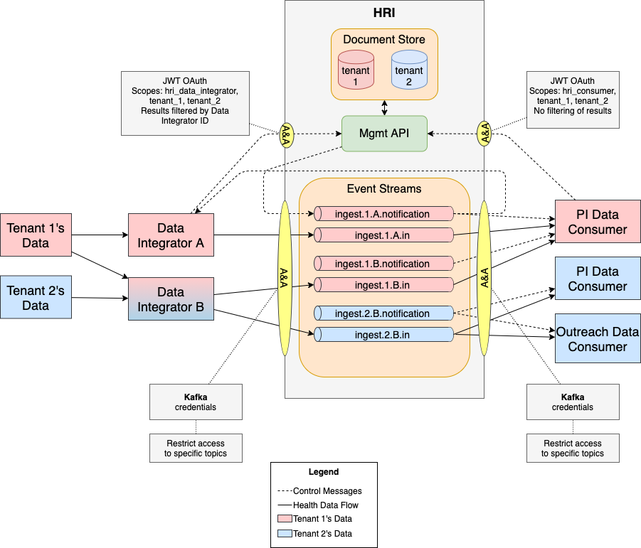

# Multi-Tenancy

### Tenants
The HRI supports the concept of multiple tenants. See the respective glossary page entries for more details on [Tenants](glossary.md#tenant) and [Multi-Tenancy](glossary.md#multitenancy). 

### Data Integrators
Additionally, data is isolated between Data Integrators. A [Data Integrator](glossary.md#data-integrator) is the organization supplying the Health data on behalf of one or more tenants. 

### Data Consumers
[Data Consumers](glossary.md#data-consumer) are downstream processes (created by some "customer" org) that read data from the HRI. The HRI is designed so that a single data consumer would read data for a single tenant, but it does not prevent a consumer from reading data for multiple tenants. Data Consumers _can see data provided by all Data Integrators_. 

---

This diagram shows the flow of two different tenant's data through the HRI via coloring. Red indicates Tenant 1's data and blue indicates Tenant 2's data. Data Integrator B is both red and blue, because it's processing data for both tenants. 

Please **note** that authorization is used to control access to tenant's data both in Event Streams and in the Management API. See the sections below for more details. 

#### Streams
A Stream is a path of data through the HRI and consists of Kafka topics. There must be at least one stream for every unique combination of tenant and Data Integrator to satisfy HIPAA requirements. This logically separates the data and enables access to be restricted by tenant and Data Integrator. Note that different Data Integrators for the same tenant are not allowed to access each other's data. To facilitate this, topics are named using the tenant and Data Integrator's name, e.g. `ingest.tenant.data-integrator.*`.

In the example above, Integrator B is processing data from two tenants and writes data to two topics, separating them by tenant. Credentials provided to Data Integrators must be locked down to specific topics.

#### Data Types
HRI is agnostic to the type of data being written to Kafka. In practice, a Data Integrator often provides a specific type of data (claims, clinical, imagery, etc.) to the HRI. Users/Consumers of HRI also may want separate provided data by type. This can be done by creating additional topics and including another (data type) identifier at the end of the topic name before `.in`.  For example, `ingest.t1.di1.claims.in`.  **Note** that _Inbound topics must end with `.in`_.

#### HRI Management API
The Management API also stores metadata about batches in separate indexes (in its Elasticsearch data store). All API endpoints include a tenant ID to support data segregation by tenant. Batch operations are segregated by Data Integrator such that one Integrator cannot access or modify the batches that another Integrator owns. See the [Authorization](auth.md) page for more details.