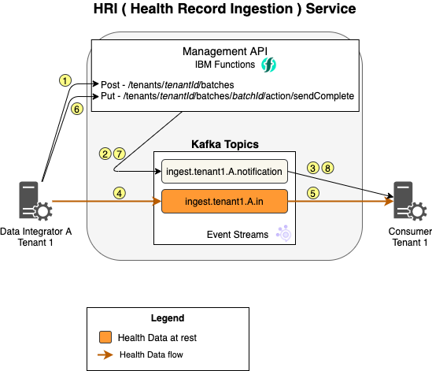
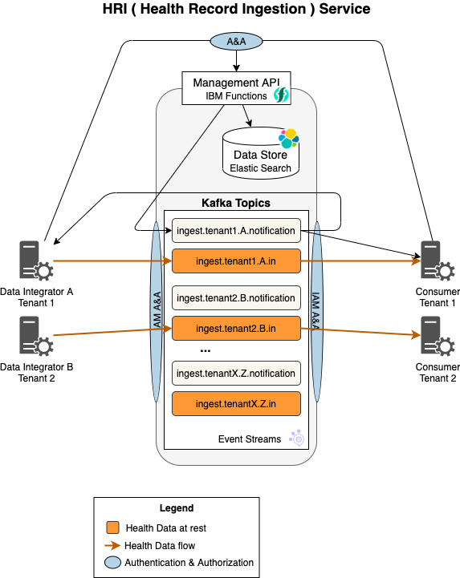
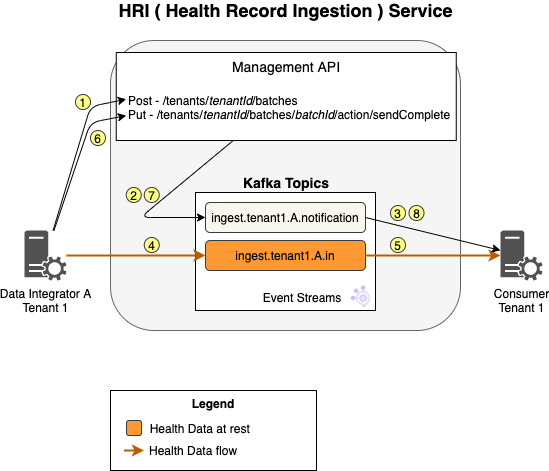
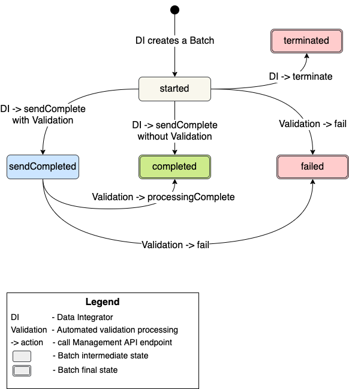

# Processing Flows

## With Validation
This diagram depicts the "happy-path" flow of health data through the HRI to a consumer for a single batch, when validation is enabled. A **batch** is **_a collection of data that must be processed together_**. Only processing some of the data would result in a bad state for the data consumer. Likewise, if there is an error with processing part of the data, typically the entire **batch** must be rejected.

### Steps
1. The [Data Integrator](glossary.md#data-integrator) creates a new batch.
1. The [Management API](glossary.md#hri-management-api) writes a 'started' batch notification message to the associated notification topic.
1. The [Data Consumer](glossary.md#data-consumer) receives the batch notification message and prepares for the incoming data.
1. Data Integrator writes the data to the Kafka `*.in` topic.
1. Validation processing validates the data and writes the data to the Kafka `*.out` topic.
1. The Data Consumer _may now_ begin reading the data from the Kafka topic but can choose to wait until step 11 to begin reading the data.
1. The Data Integrator completes writing all data contained in this batch and then signals to the Management API that it completed sending the data.
1. The Management API writes a 'sendCompleted' batch notification message to the associated notification topic.
1. The Validation processing finishes validating all the Kafka records for this batch and then signals to the Management API that it completed processing the data.
1. The Management API writes a 'completed' batch notification message to the associated notification topic.
1. The Data Consumer receives the 'completed' batch notification message.

## Alternate Flows
### Batch Termination
If the Data Integrator encounters an error after creating a batch in step 1, they may send a request to the Management API to _terminate_ the batch. The Management API will then write a 'terminated' batch notification message to the associated notification topic. Validation processing will stop forwarding records for this batch, but any records that have already been written to the `*.out` topic are **not** deleted.

### Invalid Records
If the Validation processing encounters an invalid record, an invalid record notification is written to the `*.invalid` topic. This record contains a failure message and the topic, partition, and offset of the original message. The contents of the original message are not included.

### Batch Failures
Validation processing can _fail_ Batches for two reasons: the number of invalid records reaches the Batch invalid threshold, or the number of records does not match the Batch [expected record count](apispec.md#batches). When this happens, a 'failed' batch notification message will be written to the associated notification topic. Validation processing will also stop forwarding records for this batch, but any records that have already been written to the `*.out` topic are **not** deleted.

## Without Validation
If validation is disabled, the architecture is simpler, and the flow is shortened. Below is the simplified architecture diagram.

 

There's no validation processing and only the `*.in` and `*.notification` topics are present. Below is the shortened flow. 

### Steps
1. The [Data Integrator](glossary.md#data-integrator) creates a new batch.
2. The [Management API](glossary.md#hri-management-api) writes a batch notification message to the associated notification topic.
3. The [Data Consumer](glossary.md#data-consumer) receives the batch notification message.
4. Data Integrator writes the data to the correct Kafka `*.in` topic.
5. The Data Consumer _may now_ begin reading the data from the Kafka topic but can choose to wait until step 8 to begin reading the data.
6. The Data Integrator completes writing all data contained in this batch and it then signals to the Management API that it completed sending the data for the batch.
7. The Management API writes a batch notification message to the associated notification topic.
8. The Data Consumer receives the batch notification message.

## Batch Status Transitions
Batches can go through several status changes, and for each change a notification message is written to the `*.notification` topic. Below is a state diagram indicating all the states and the transition events. Note that the transitions are slightly different depending on whether validation has been enabled.

 

### Interleaved Batches
The HRI does not prevent the Data Integrator from writing multiples batches into the same topic at the same time. Every record will have a header value that specifies the ["batchId"](glossary.md#batch-id), which is returned from the Management API (see [hri-api-spec/management-api/management.yml](https://github.com/Alvearie/hri-api-spec/blob/support-2.x/management-api/management.yml)), so the Data Consumer can distinguish each one. 

In practice, the Data Integrator may only write one batch at a time. As necessary, additional input topics can be created to prevent the interleaving of batches or data types. However, please note that, in general, **_Kafka performs better with a small number of large topics_**.
