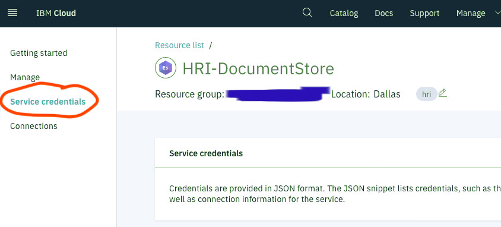
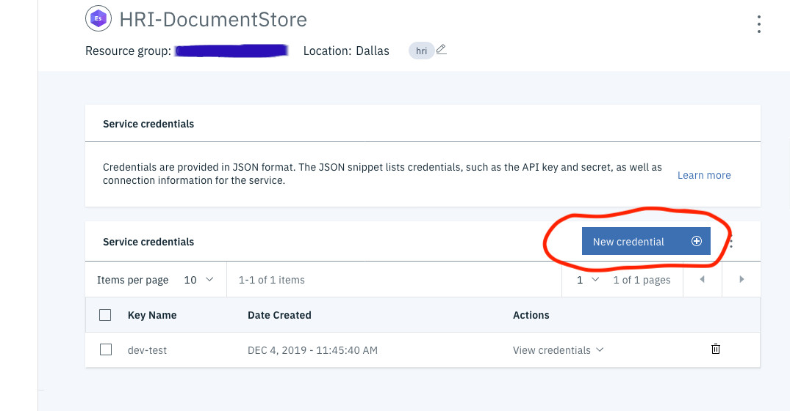
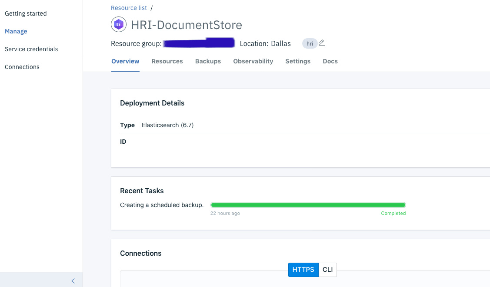
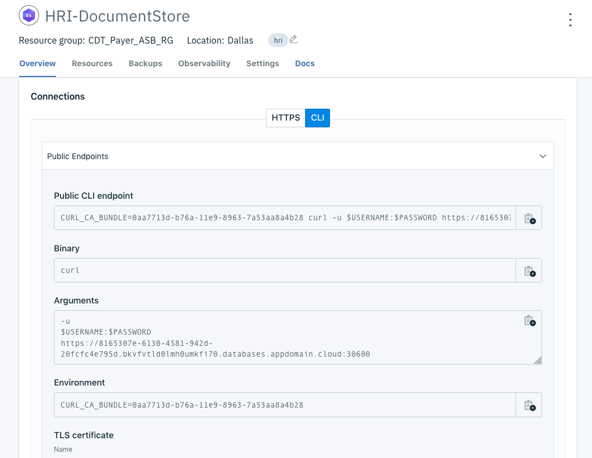
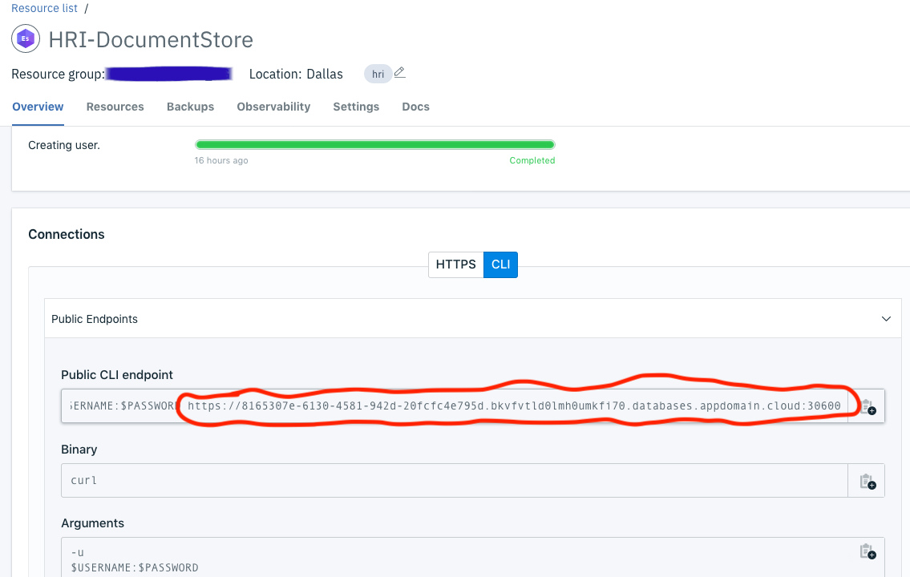

# Troubleshooting

## HRI Management API Issues

### Authentication is possible but has failed or not yet been provided

**Issue:** the Management API responds with this error:
```json
{
  "code": "2cde977c23b3ab78befed56a6aac3820",
  "error": "Authentication is possible but has failed or not yet been provided."
}
```

**Cause:** the IBM Functions API Gateway is unable to authenticate with the backend IBM Function Actions. Actions have an API key and the API Gateway must be configured to use that API key. Typically, this is due to the API Gateway missing or having the wrong API key.

**Fix:** <br>
**Option 1**. Try redeploying the Management API. This will generate a new API key and set it on the Actions and the API Gateway endpoints.

**Option 2**. Manually update the API endpoints.

1. You will need the IBM Cloud CLI and Functions plugin. See these [instructions](https://cloud.ibm.com/docs/openwhisk?topic=openwhisk-cli_install) for installing them.
2. Set the CLI resource group to where the Management API is deployed.

        ibmcloud target -g <resource_group>

3. Set the CLI Functions namespace to where the Management API is deployed.

        ibmcloud fn namespace target <namespace>

4. Recreate all the API methods. Below is an example of the create batch endpoint. Reference `mgmt-api-manifest.yml` for a complete list of the endpoints and their associated actions.

        ibmcloud fn api create /hri /tenants/{tenantId}/batches post hri_mgmt_api/create_batch --response-type http


**Option 3**. Manually update the API gateway JSON configuration.

1. Follow steps 1-3 above to set up the IBM CLI.
2. Download the API json configuration.

        ibmcloud fn api get hri-batches > api.json

3. Get the API key set for the Actions. Run

        ibmcloud fn package get hri_mgmt_api

   and the output should have a `"require-whisk-auth"` entry for each action. It should be the same value for every action. E.g:

        {
            "key": "require-whisk-auth",
            "value": "hIadvQ8w4nkJeWa3i7OPDb9WqTAUV9d6"
        },

4. Edit the `api.json` file and add or replace the API key. There will be a `x-ibm-configuration` element, and a couple of layers inside, an array of `execute` elements, one for each endpoint. Each of these needs to have a `set-variable.actions` element that sets `message.headers.X-Require-Whisk-Auth` to the API key. Make sure there is one for every endpoint and that they match the API key from step 3.
```json
{
		"execute": [
		    {
		        "invoke": {
		            "target-url": "https://us-south.functions.cloud.ibm.com/api/v1/web/a98e053a-4a77-46b3-9791-53d4dfa370fb/hri_mgmt_api/get_batches.http$(request.path)",
		            "verb": "keep"
		        }
		    },
		    {
		        "set-variable": {
		            "actions": [
		                {
		                    "set": "message.headers.X-Require-Whisk-Auth",
		                    "value": "hIadvQ8w4nkJeWa3i7OPDb9WqTAUV9d6"
		                }
		            ]
		        }
		    }
		],
		"operations": [
		    "getTenantsTenantidBatches"
		]
}
```


## Event Streams Issues

### SSL Certificate Issues
**Issue:** when attempting to connect to [Event Streams](glossary.md#event-streams) you receive SSL errors. In Java, you might get this exception `sun.security.provider.certpath.SunCertPathBuilderException: unable to find valid certification path to requested target`. With curl, you get this error `SSL Certificate: Invalid certificate chain`.

**Cause:** the Enterprise Event Streams brokers use a certificate signed by` issuer=C = US, O = Let’s Encrypt, CN = Let’s Encrypt Authority X3`  which is different from Standard versions. Whatever client is connecting to Event Streams is missing the Let's Encrypt public certificate. For Java, this certificate was added in version `8u101`.

**Fix:** add the Let's Encrypt public certificate to your trusted root certificates. This varies depending on what technology you are using. Java comes with its own 'truststore' with root certificates and all operating systems also store root certificates. The Let's Encrypt certificates can be downloaded [here](https://letsencrypt.org/certificates/). There are several guides online for adding certificates to the Java trust store. Here's [one](https://docs.oracle.com/javase/tutorial/security/toolsign/rstep2.html) from Oracle. Here is a [guide](https://bounca.org/tutorials/install_root_certificate.html) for several operating systems.

## Elasticsearch

### Setup Curl with IBM Elasticsearch
Below are instructions for setting up Curl to interact with the Elasticsearch API directly. This can be useful when investigating issues or in some update scenarios like modifying existing index templates.

1. Note: this requires the use of the [command-line cURL](https://github.com/curl/curl) tool
2. In your IBM Cloud [Elasticsearch (Document Store)](glossary.md#elasticsearch) account, you will need to have either:
   * an existing Service Credential you can access  OR
   * create a new Service Credential that you will use below for the `$USERNAME` and  `$PASSWORD` needed to run the Elasticsearch REST commands

To create a new Service Credential:

Navigate to the Elasticsearch service instance in your [IBM Cloud account](https://cloud.ibm.com/login). Then click on the "Service Credentials" link on the left-hand side Elasticsearch service menu:



On the Service Credentials page click the New Credential button:



You will name your new credential and click the "Add" button. After that, your credential will be generated for you and you will be able to click on the "View Credentials" link. From this expanded service credentials window, you may retrieve your newly created Elasticsearch Username and Password that you will need for the Elasticsearch REST commands using cURL.

Next, you will need to download the certificate and export it, so cURL can authenticate with the IBM Cloud Elasticsearch instance. To do this:

Navigate to the Management screen for your Elasticsearch instance, which will look something like this (ID field obscured in the ScreenCap for security):



Scroll down your screen, and in the "Connections" panel, click on the "CLI" toggle. You will be using cURL to run commands from your local environment on the IBM Cloud Elasticsearch instance. See this page in the IBM Cloud Documentation for more info on [Connecting to Elasticsearch with cURL](https://cloud.ibm.com/docs/services/databases-for-elasticsearch?topic=databases-for-elasticsearch-connecting-curl).



In the "Connections" panel, there is a section for _TLS Certificate_. You will want to save the text from the "Contents" panel in that TLS Certificate section to a local file such as:

    /Users/[yourLocalUserName]/certs/hri-documentstore.crt 

Use the contents of this file with cURL by exporting it to `CURL_CA_BUNDLE`.

    export CURL_CA_BUNDLE=/local-path/to/file/hri-documentstore.crt

Find the base url in the "Public CLI endpoint" textbox. In this example it starts with `https://8165307`:



You can now interact with the Elasticsearch REST API using cURL. For example, you can get the status of the cluster by performing a `GET` on the `_cluster/health?pretty` endpoint.

    curl -X GET -u <username>:<password> \
      https://8165307e-6130-4581-942d-20fcfc4e795d.bkvfvtld0lmh0umkfi70.databases.appdomain.cloud:30600/_cluster/health?pretty

You can get the default index template by performing a `GET` to the `_index_template/batches` endpoint.

    curl -X GET -u <username>:<password> \
      https://8165307e-6130-4581-942d-20fcfc4e795d.bkvfvtld0lmh0umkfi70.databases.appdomain.cloud:30600/_index_template/batches

You can also get the mapping for existing indexes (one per tenant) at `<index>/_mapping`.

    curl -X GET -u <username>:<password> \
      https://8165307e-6130-4581-942d-20fcfc4e795d.bkvfvtld0lmh0umkfi70.databases.appdomain.cloud:30600/test-batches/_mapping
