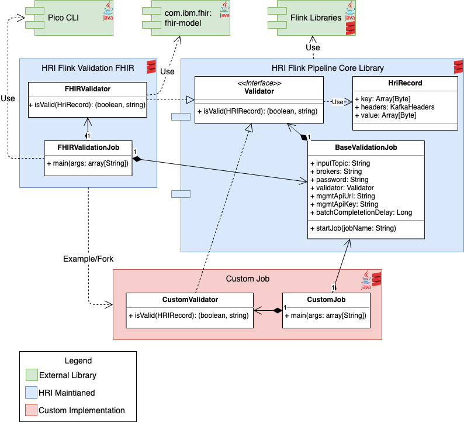

# Validation Processing
The HRI performs both batch and record level validation, when enabled. See [Deployment](deployment.md) for information on how to enable it, and [Processing Flows](processflow.md) for information on how it fits into the overall architecture.

## Batch Validation
Batch validation is the same for all jobs and includes the following checks.

1. The number of records received for each batch must equal the expected number of records, which is provided by the Data Integrator. Because Data Integrators could send additional messages at any time, the validation processing will wait a configurable amount of time (the "batch completion delay") for extra messages. Then if the number of received records still equals the expected amount, the batch is completed and future records are ignored. The default batch completion delay is 5 minutes, but can be configured for each Flink validation job.

1. The number of invalid records must be lower than the invalid threshold, which is provided by the Data Integrator.

## Error Handling in Validation
During batch validation, HRI Management API calls are made to get batches by batchId and tenantId, mark batches as processing complete, or mark batches as failed. If these API calls fail, the validation process may exit with an exception, retry the request, or continue on ignoring the failure depending on the HTTP status code that was returned.

The batch status tracker will call `processingComplete` or `fail` for batches. If an HTTP status code of `409` is received, indicating that the batch is already in the desired state, a warning message will be logged but no other errors will be raised. If any other HTTP status code in the `400`s (e.g. `400-Bad Request`, `401-Unauthorized`) is returned, the attempt to update the status of the batch will immediately fail since this indicates something is wrong with the status update request, and there is little point in retrying the update. For any other HTTP error status code, the Management API sink will retry the status update for 24 hours, with an exponentially increasing amount of time between each attempt.

When the validation processor attempts to get a batch by batchId and tenantId, if an HTTP error status code of `404` is returned indicating that the batch ID or tenant ID was not found, a warning message will be logged, and the records will be written to the `*.invalid` topic, but no other errors will be raised. This is because such an error is likely due to a mistake by a data integrator, and does not warrant a more aggressive failure by the validation processor. If any other HTTP status code in the `400`s (e.g. `400-Bad Request`, `401-Unauthorized`) is returned, the validation will immediately fail. This indicates something is wrong with the HTTP requests, and there is little point in retrying. For any other HTTP error status code, the validation processor will retry for 24 hours, with an exponentially increasing amount of time between each attempt.

## Record Validation
The record level validation is specific to the job type, and the HRI provides two standard validation jobs that can be used by solutions without any additional development.

- FHIR Validation - validates that every record meets the [FHIR v4.0.1](https://hl7.org/fhir/resourcelist.html) bundle json schema

- Passthrough Validation - does not perform any **_record_** validation and simply passes records through

### Custom Record Validation
Solutions can create their own validation jobs to meet their specific needs. The `flink-pipeline-core` library provides the Flink job structure and is hosted in GitHub packages. Using this library, solutions only have to implement a custom validator and an entry main method, and then package the code into a deployable jar. It can be written in Java or Scala, and the two standard HRI validators can be used as references. 

Below is a class diagram of the Flink pipeline core library, the FHIR validation job, and a custom validation job. It shows the class dependencies between the projects and what a custom validation job has to implement.

Additional Resources:

- Flink Pipeline Core - Base Flink library 
    - GitHub repo: [https://github.com/Alvearie/hri-flink-pipeline-core](https://github.com/Alvearie/hri-flink-pipeline-core)
    - Dependency declaration: 

            org.alvearie.hri.flink:hri-flink-pipeline-core:3.0-1.0.2

- Flink Validation FHIR - FHIR schema validation written in Scala. The FHIR validator is also published as a library in GitHub packages.
    - GitHub repo: [https://github.com/Alvearie/hri-flink-validation-fhir](https://github.com/Alvearie/hri-flink-validation-fhir)
    - FHIR schema validator dependency declaration: 

            org.alvearie..hri.flink:hri-flink-validator-fhir:3.0-1.0.2
  
- Flink Validation Passthrough - Passthrough validation written in Java
    - GitHub repo: [https://github.com/Alvearie/hri-flink-validation-passthrough](https://github.com/Alvearie/hri-flink-validation-passthrough)
