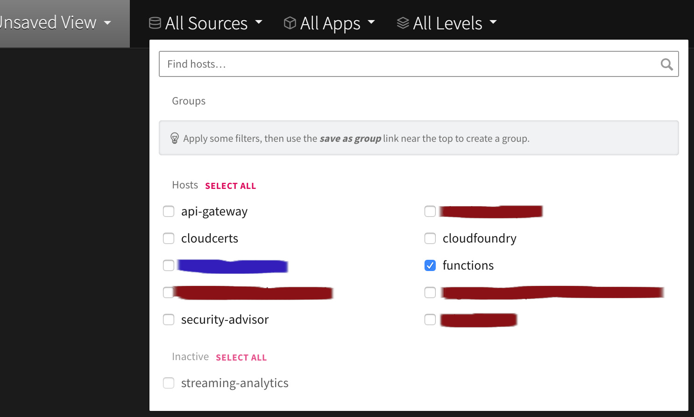
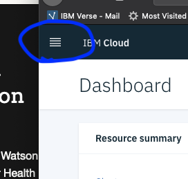
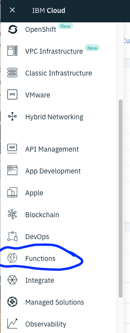
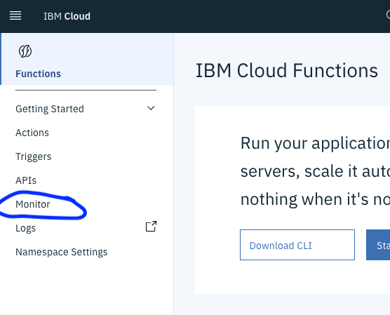
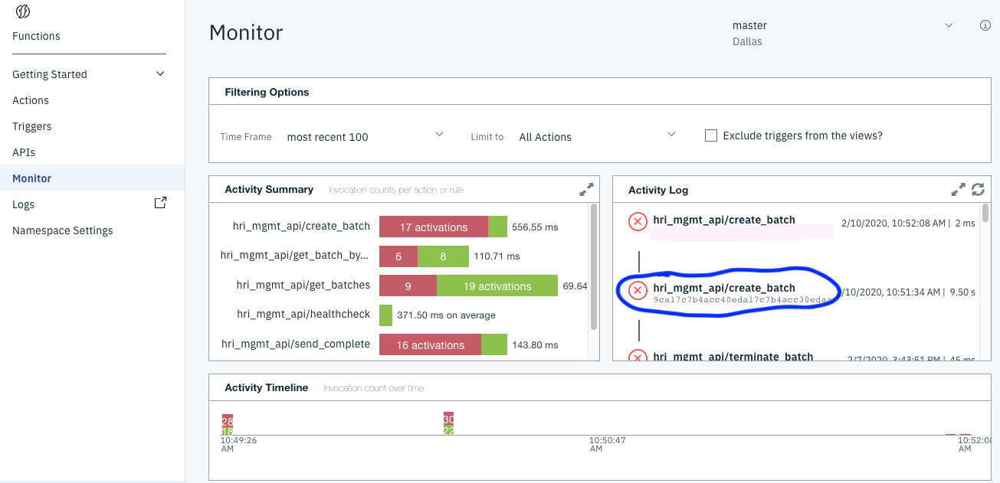

# Monitoring and logging

[Logging with LogDNA](#log-files-with-logdna)

[Management API monitoring tools](#hri-management-api-monitoring-tools)

[New Relic synthetic monitor](#new-relic-synthetic-monitor)

[User data access logging](#user-data-access-logging)

## Logging with LogDNA  
For application logging purposes, Health Record Ingestion uses the IBM&reg; Cloud LogDNA service. In Health Record Ingestion, there are two sources of logs: 

- The [Management API ](glossary.md#management-api) (IBM Functions) 
- The Document Store [(Elastic Search)](glossary.md#elasticsearch)

Both send logs to the LogDNA instance designated for Platform Logs in your particular IBM Cloud Region for your [IBM Cloud Functions](glossary.md#ibm-cloud-functions) account. 

For more information about LogDNA, see [IBM Cloud LogDNA](https://cloud.ibm.com/docs/Log-Analysis-with-LogDNA)

**To use LogDNA:**

1. Open the correct instance of LogDNA. Use the LogDNA instance associated with your Resource Group. Use the group that's located in the region where your IBM Cloud Functions instance is located, for example, `Dallas(US-South)`.
2. Click **View LogDNA**. 

### Using LogDNA to view Health Record Ingestion logs
After you open the correct instance of LogDNA, you'll typically use filtering to find logs of interest. 

**To filter logs:**
1. Try filtering by source. Select from the menus in the menu bar. 

**Figure 1: Filtering logs by function**

   

**Examples**
- To filter for IBM Functions log messages, go to the **All Sources** menu and select **functions** (Figure 1).
- To filter for Elastic Search logs, You would select `ibm-cloud-database-prod`. 
- To filter to a specific instance, go to **All Apps** menu and use the Cloud Resource Name (CRN) identifier. 

In addition, you can filter by keyword in the log. For example, the keyword **batches/** is in the path of the REST API request for many Management API operations. 

## Management API Monitoring Tools
To help with supporting an application by identifying potential issues, IBM Cloud Functions provides built-in monitoring tools. To start any monitoring investigation or to search for potential issues, start at the Cloud Functions Monitor page. 

**To monitor activities and functions:**

1. Sign in to your [IBM Cloud account](https://cloud.ibm.com/login).
2. Next to **IBM Cloud**, click the navigation menu and select **Functions**.

**Figure 2: Navigation menu**

**Figure 3: The Functions option**

3. On the IBM Cloud Functions page, at the upper right, select the appropriate namespace for your particular Health Record Ingestion functions deployment. For example, in Figure 4, the Health Record Ingestion integration instance is deployed to the **"HRI-API"** namespace. 

To learn about namespaces and cloud functions, see [Managing namespaces](https://cloud.ibm.com/docs/openwhisk?topic=openwhisk-namespaces). 

**Figure 4: Selecting a namespace**

4. On the IBM Functions main page, on the **Functions** menu, click **Monitor**.

**Figure 5: Accessing monitoring**

5. On the IBM Functions Monitor page, note the **Activity Summary** panel, the **Activity Log** panel, and the **Activity Timeline** panel. Check the **Activity Log** panel when investigating possible Health Record Ingestion errors or performance issues.

To review details of a function call instance, click the activationId for any given function activity. In Figure 6, for the `create_batch` function call, the activationId is the alphanumeric string starting with **9ca17c7b4acc**.

**Figure 6: An activationId in the Activity Log panel**

   

Clicking the activationId link opens a tab that shows the details of that particular function call. Details include the path and any possible error event or description. 

**Figure 7: Details for a function call**

 

**Tip:** You can use the activationId to search for the event in LogDNA log files. 

**Methods of monitoring**

- To determine what occurred around an error or other issue, check other messages logged at approximately the same time as the event, for example, slightly before and slightly after. 
- Every error response from the Management API includes the request's activationId. This ID should match the value in the [errorEventId](https://github.com/Alvearie/hri-api-spec/tree/master/management-api/management.yml#L821) field. In Figure 7, the activationId appears at the top of the JSON output. So, if a client receives an error response, you can use the **errorEventId** value to find the details about that specific API invocation.

## Using the New Relic&copy; Synthetic Monitor
To configure a New Relic Monitoring instance for your deployed Health Record Ingestion service, access the health check endpoint. For information about how we configure New Relic, see the new-relic-healthcheck.js inside the [mgmt-api GitHub repository](https://github.com/Alvearie/hri-mgmt-api/tree/master/monitors).   

## User data access logging
Health Insurance Portability and Accountability Act (HIPAA) regulations require logging all access to [Protected Health Information, PHI](glossary.md#phi) data. In Health Record Ingestion, PHI is only persisted in Event Streams, which automatically logs access to Activity Tracker. To learn more, see [Activity Tracker events](https://cloud.ibm.com/docs/services/EventStreams?topic=eventstreams-at_events). 

To view these access logs, go to the [Activity Tracker](https://cloud.ibm.com/observe/activitytracker) instance for your account. It has the same LogDNA interface mentioned in this topic. You can filter logs by either or both source and application.