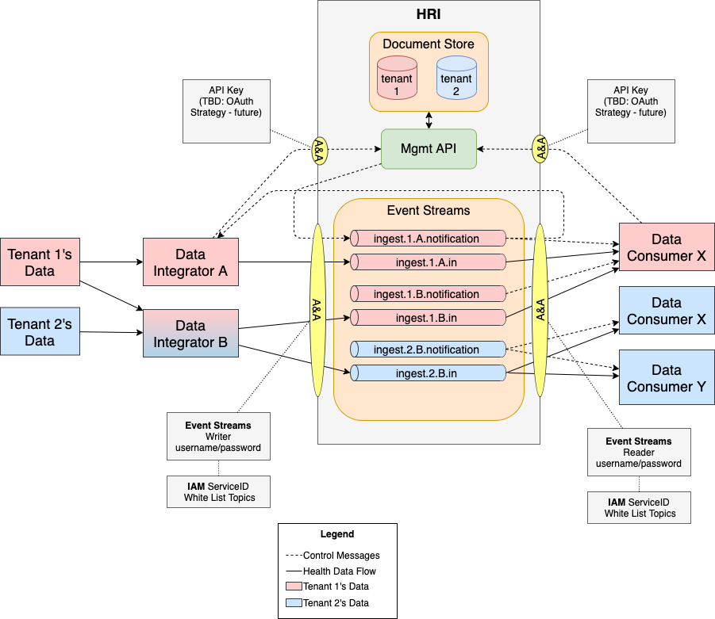

# Multi-tenancy

Health Record Ingestion supports the concept of [**multi-tenancy**](glossary.md#multitenancy), for multiple [tenants](glossary.md#tenant). 

In Health Record Ingestion, data is isolated between [**Data Integrators**](glossary.md#data-integrator), that is, the organizations that supply health data on behalf of one or more tenants. 

Customer organizations create **Data Consumers**, which are downstream processes that read data from Health Record Ingestion. The latter is designed so that a single data consumer reads data for a single tenant. However, this does not prevent a consumer from reading data for multiple tenants. Data Consumers **can see data provided by all Data Integrators**. 

Figure 1 shows the color-coded flow of two different tenants through Health Record Ingestion: 

- The **red color** indicates Tenant 1's data. 
- The **blue color** indicates Tenant 2's data. 
- Data Integrator B is both red and blue, because it processes data for both tenants.

**Figure 1: Core architecture, multi-tenancy and Health Record Ingestion**

**Note:** Currently, the Management API uses IBM&reg; Functions API keys for authentication. For more information, see [Setting up Management API keys](admin.md#hri-management-api-keys). 

#### About Event Streams topics
In Event Streams, there must be at least one topic for every tenant and Data Integrator. To facilitate this, topics are named using the tenant and Data Integrator's name. Example:

**ingest.tenant.data-integrator**

In Figure 1, Integrator B is processing data from two tenants and writes data to two topics, separating them by tenant. Event Streams credentials provided to Data Integrators are restricted to specific topics. For more information, see [Creating service credentials for Kafka permissions](admin.md#creating-service-credentials-for-kafka-permissions).

##### About data types
Health Record Ingestion is agnostic to the type of data being written to Kafka. In practice, a Data Integrator often provides a specific type of data, for example, claims data, clinical data, and imagery data, to Health Record Ingestion. Users and consumers of Health Record Ingestion might also want separate provided data by type. To do this, create additional topics and include another (data type) identifier at the end of the topic name before `.in`. Example:

**ingest.t1.di1.claims.in**

**Note:** Inbound topics must end with **.in**.

#### About the Management API
In Health Record Ingestion, the Management API also stores metadata about batches in separate indexes, in its Elasticsearch data store. All API endpoints include a tenant ID to support data segregation by tenant. 