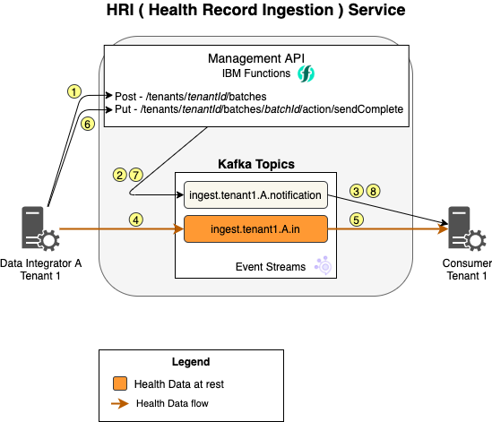

# Processing flows

Figure 1 provides an overview of how processing works in the Health Record Ingestion service. In it, you'll see a normally-functioning flow through Health Record Ingestion for a single [batch](glossary.md#batch). Each numbered step in the diagram is described below.

**Figure 1: Processing flow for a batch**

### Steps in the processing flow
1. The [Data Integrator](glossary.md#data-integrator) creates a new batch.
2. The [Management API](glossary.md#management-api) writes a batch notification message to the associated notification topic.
3. The [Data Consumer](glossary.md#data-consumer) receives the batch notification message.
4. Data Integrator writes the data to the correct Kafka `*.in` topic.
5. The Data Consumer **can now** start reading the data from the Kafka topic but can choose to wait until step 8 to begin reading the data.
6. The Data Integrator completes writing all data contained in this batch. Then, it signals to the Management API that it completed sending the data for the batch.
7. The Management API writes a batch notification message to the associated notification topic.
8. The Data Consumer receives the batch notification message.

## Alternate flows
### Batch termination
If the Data Integrator encounters an error after creating a batch in step 2 earlier in this topic, the integrator can send a request to the Management API to **terminate** the batch. Then, the Management API writes a batch notification message  to the associated notification topic, and the Data Consumer receives it.

### Interleaved batches
Health Record Ingestion does not prevent the Data Integrator from writing multiple batches into the same topic at the same time. Each record has a header value that specifies the ["batchId"](glossary.md#batch-id), which is returned from the Management API, so the Data Consumer can distinguish each one. 

To review a batchId in the Management API on GitHub, click [here](https://github.com/Alvearie/hri-api-spec/tree/master/management-api/management.yml#L36). 

In practice, the Data Integrator can only write one batch at a time. As needed, additional input topics can be created to prevent the interleaving of batches or data types. 

**Note:** Generally, **Kafka performs better with a small number of large topics**.
